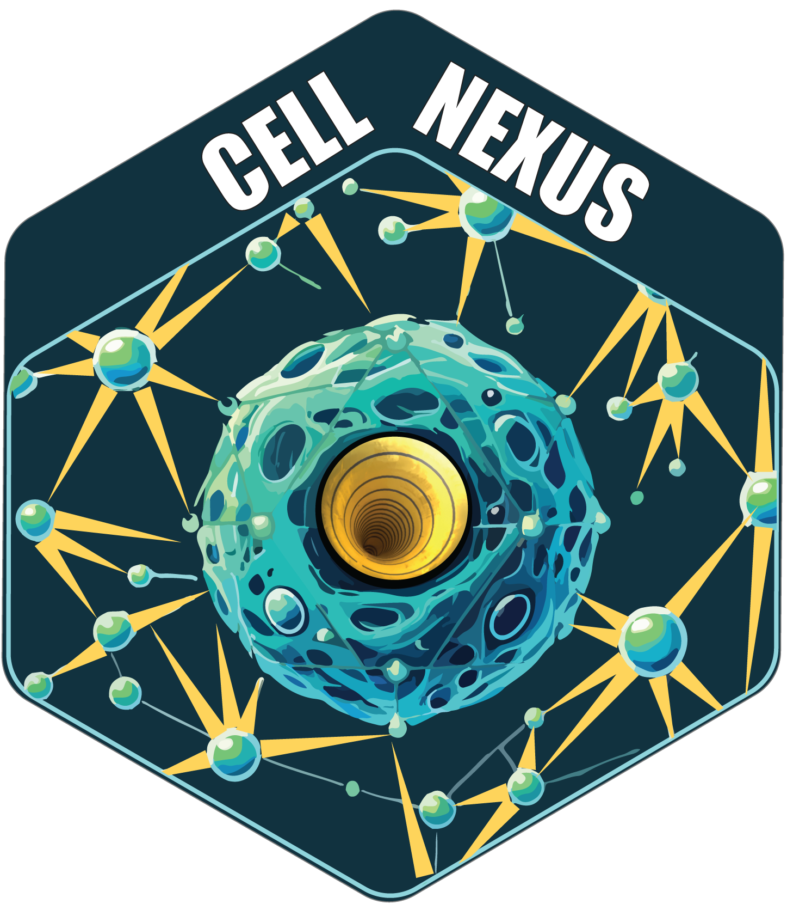
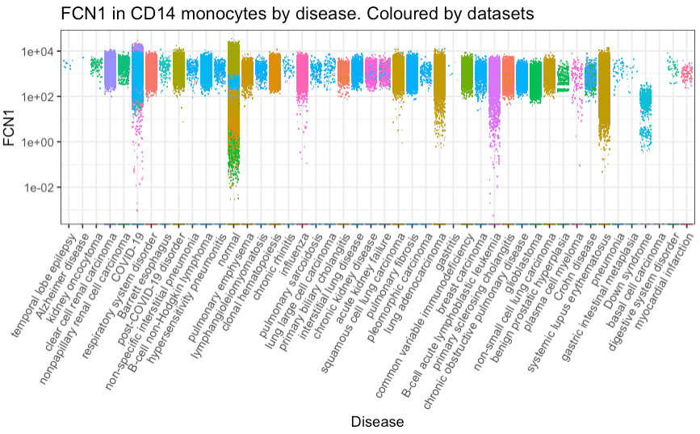
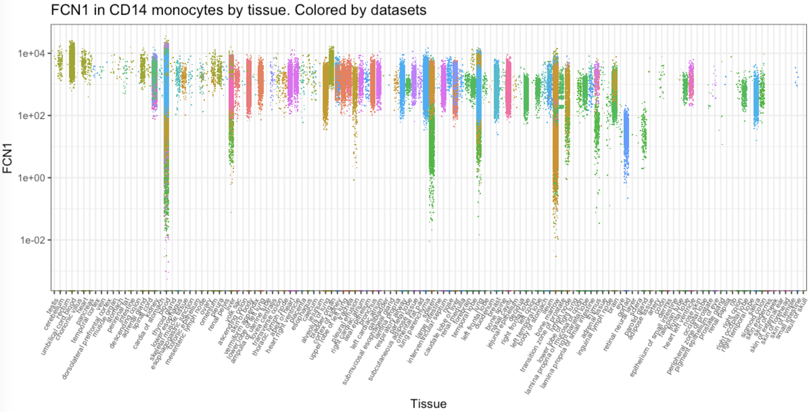

cellNexus
================

<!-- badges: start -->

[](https://www.tidyverse.org/lifecycle/#maturing)
<!-- badges: end -->

`cellNexus` is a query interface that allow the programmatic exploration
and retrieval of the harmonised, curated and reannotated CELLxGENE
single-cell human cell atlas. Data can be retrieved at cell, sample, or
dataset levels based on filtering criteria.

Harmonised data is stored in the ARDC Nectar Research Cloud, and most
`cellNexus` functions interact with Nectar via web requests, so a
network connection is required for most functionality.




# Query interface

## Installation

``` r
devtools::install_github("MangiolaLaboratory/cellNexus")
```

## Load the package

``` r
library(cellNexus)
```

Load additional packages

``` r
suppressPackageStartupMessages({
    library(ggplot2)
})
```

## Load and explore the metadata

### Load the metadata

``` r
metadata <- get_metadata(cloud_metadata = METADATA_URL)
metadata
```

    #> # Source:   SQL [?? x 94]
    #> # Database: DuckDB v1.2.2 [shen.m@Darwin 23.3.0:R 4.5.0/:memory:]
    #>    cell_id            dataset_id observation_joinid sample_id cell_type cell_type_ontology_t…¹ sample_ assay
    #>    <chr>              <chr>      <chr>              <chr>     <chr>     <chr>                  <chr>   <chr>
    #>  1 FCAImmP7528294-AC… cda2c8cd-… p5e=WoIq0d         034f0fb1… monocyte  CL:0000576             034f0f… 10x …
    #>  2 FCAImmP7528294-CA… cda2c8cd-… I6>u{Gb-J_         034f0fb1… monocyte  CL:0000576             034f0f… 10x …
    #>  3 FCAImmP7528294-TT… cda2c8cd-… *_#lQ<oUnT         034f0fb1… monocyte  CL:0000576             034f0f… 10x …
    #>  4 FCAImmP7528294-TC… cda2c8cd-… zHCZWNmUHu         034f0fb1… monocyte  CL:0000576             034f0f… 10x …
    #>  5 FCAImmP7528294-GA… cda2c8cd-… -NL-OH3!IA         034f0fb1… monocyte  CL:0000576             034f0f… 10x …
    #>  6 FCAImmP7528294-CT… cda2c8cd-… 6mRCZW}rOM         034f0fb1… monocyte  CL:0000576             034f0f… 10x …
    #>  7 FCAImmP7528294-CA… cda2c8cd-… lx`7Bo-&7n         034f0fb1… monocyte  CL:0000576             034f0f… 10x …
    #>  8 FCAImmP7528294-AA… cda2c8cd-… *NUPW@J{c2         034f0fb1… monocyte  CL:0000576             034f0f… 10x …
    #>  9 FCAImmP7528294-AA… cda2c8cd-… KIV>qGFIS?         034f0fb1… monocyte  CL:0000576             034f0f… 10x …
    #> 10 FCAImmP7579218-TG… cda2c8cd-… IdHwp1GBZm         03ddfd57… monocyte  CL:0000576             03ddfd… 10x …
    #> # ℹ more rows
    #> # ℹ abbreviated name: ¹​cell_type_ontology_term_id
    #> # ℹ 86 more variables: assay_ontology_term_id <chr>, cell_count <chr>, citation <chr>, collection_id <chr>,
    #> #   dataset_version_id <chr>, default_embedding <chr>, development_stage <chr>,
    #> #   development_stage_ontology_term_id <chr>, disease <chr>, disease_ontology_term_id <chr>,
    #> #   donor_id <chr>, experiment___ <chr>, explorer_url <chr>, feature_count <int>, filesize <dbl>,
    #> #   filetype <chr>, is_primary_data <chr>, mean_genes_per_cell <dbl>, organism <chr>, …

Metadata is saved to `get_default_cache_dir()` unless a custom path is
provided via the cache_directory argument. The `metadata` variable can
then be re-used for all subsequent queries.

### Explore the tissue

``` r
metadata |>
    dplyr::distinct(tissue, cell_type_unified_ensemble) 
#> # Source:   SQL [?? x 2]
#> # Database: DuckDB v1.2.2 [shen.m@Darwin 23.3.0:R 4.5.0/:memory:]
#>    tissue              cell_type_unified_ensemble
#>    <chr>               <chr>                     
#>  1 breast              nk                        
#>  2 lung parenchyma     treg                      
#>  3 frontal lobe        nk                        
#>  4 lung                cd4 th1/th17 em           
#>  5 respiratory airway  cd4 th1/th17 em           
#>  6 nose                cd4 th1/th17 em           
#>  7 sigmoid colon       cd14 mono                 
#>  8 respiratory airway  secretory                 
#>  9 right parietal lobe nk                        
#> 10 thymus              cd14 mono                 
#> # ℹ more rows
```

## Quality control

cellNexus metadata applies standardised quality control to filter out
empty droplets, dead or damaged cells, doublets, and samples with low
gene counts.

``` r
metadata = metadata |> 
  dplyr::filter(empty_droplet == FALSE,
         alive == TRUE,
         scDblFinder.class != "doublet",
         feature_count >= 5000)
```

## Download single-cell RNA sequencing counts

### Query raw counts

``` r
single_cell_counts = 
    metadata |>
    dplyr::filter(
        self_reported_ethnicity == "African" &
        assay |> stringr::str_like("%10x%") &
        tissue == "lung parenchyma" &
        cell_type |> stringr::str_like("%CD4%")
    ) |>
    get_single_cell_experiment()
#> ℹ Realising metadata.
#> ℹ Synchronising files
#> ℹ Reading files.
#> ℹ Compiling Experiment.

single_cell_counts
#> class: SingleCellExperiment 
#> dim: 56239 1055 
#> metadata(0):
#> assays(1): counts
#> rownames(56239): ENSG00000121410 ENSG00000268895 ... ENSG00000135605 ENSG00000109501
#> rowData names(0):
#> colnames(1055): LAP92_CATTCTAGTGCGGATA-1_duong___9f222629-9e39-47d0-b83f-e08d610c7479_1
#>   LAP92_CTCATGCCACCTGATA-1_duong___9f222629-9e39-47d0-b83f-e08d610c7479_1 ...
#>   LAP87_ACTTCGCCAAGACAAT-1_duong___9f222629-9e39-47d0-b83f-e08d610c7479_51
#>   LAP87_CGTCAAAAGACGGAAA-1_duong___9f222629-9e39-47d0-b83f-e08d610c7479_51
#> colData names(95): dataset_id observation_joinid ... dir_prefix original_cell_
#> reducedDimNames(0):
#> mainExpName: NULL
#> altExpNames(0):
```

### Query counts scaled per million

``` r
single_cell_counts = 
    metadata |>
    dplyr::filter(
        self_reported_ethnicity == "African" &
        assay |> stringr::str_like("%10x%") &
        tissue == "lung parenchyma" &
        cell_type |> stringr::str_like("%CD4%")
    ) |>
    get_single_cell_experiment(assays = "cpm")
#> ℹ Realising metadata.
#> ℹ Synchronising files
#> ℹ Reading files.
#> ℹ Compiling Experiment.

single_cell_counts
#> class: SingleCellExperiment 
#> dim: 56239 1055 
#> metadata(0):
#> assays(1): cpm
#> rownames(56239): ENSG00000121410 ENSG00000268895 ... ENSG00000135605 ENSG00000109501
#> rowData names(0):
#> colnames(1055): LAP92_CATTCTAGTGCGGATA-1_duong___9f222629-9e39-47d0-b83f-e08d610c7479_1
#>   LAP92_CTCATGCCACCTGATA-1_duong___9f222629-9e39-47d0-b83f-e08d610c7479_1 ...
#>   LAP87_ACTTCGCCAAGACAAT-1_duong___9f222629-9e39-47d0-b83f-e08d610c7479_51
#>   LAP87_CGTCAAAAGACGGAAA-1_duong___9f222629-9e39-47d0-b83f-e08d610c7479_51
#> colData names(95): dataset_id observation_joinid ... dir_prefix original_cell_
#> reducedDimNames(0):
#> mainExpName: NULL
#> altExpNames(0):
```

### Query pseudobulk

``` r
pseudobulk_counts = 
   metadata |>
    dplyr::filter(
        self_reported_ethnicity == "African" &
        assay |> stringr::str_like("%10x%") &
        tissue == "lung parenchyma" &
        cell_type |> stringr::str_like("%CD4%")
    ) |>
    get_pseudobulk()
#> ℹ Realising metadata.
#> ℹ Synchronising files
#> ℹ Reading files.
#> ℹ Compiling Experiment.

pseudobulk_counts
#> class: SingleCellExperiment 
#> dim: 56239 68 
#> metadata(0):
#> assays(1): counts
#> rownames(56239): ENSG00000000003 ENSG00000000005 ... ENSG00000290292 ENSG00000291237
#> rowData names(0):
#> colnames(68): a2459ad4272363e6eb775e8e99607c3e___cd4 th1 em
#>   bfe624d44f7e5868cc22e11ad0f13866___cd4 th1 em ... 270eb221dd0456cc063240404aec74cd___cd4
#>   th1/th17 em 9c8fa5a8d2ae37179b579a0217670512___LAP87_1_duong___cd4 th2 em
#> colData names(56): dataset_id sample_id ... dir_prefix sample_identifier
#> reducedDimNames(0):
#> mainExpName: NULL
#> altExpNames(0):
```

### Query metacell

The metadata includes a series of metacell aggregation levels, beginning
with 2, 4, 8, and so on. For example, the value of metacell_2 represents
a grouping of cells that can be split into two distinct metacells.

``` r
metacell_counts = 
   metadata |>
    dplyr::filter(!is.na(metacell_2)) |>
    dplyr::filter(
        self_reported_ethnicity == "African" &
        assay |> stringr::str_like("%10x%") &
        tissue == "lung parenchyma" &
        cell_type |> stringr::str_like("%CD4%")
    ) |>
    get_metacell(cell_aggregation = "metacell_2")
#> ℹ Realising metadata.
#> ℹ Synchronising files
#> ℹ Reading files.
#> ℹ Compiling Experiment.

metacell_counts
#> class: SingleCellExperiment 
#> dim: 56239 543 
#> metadata(0):
#> assays(1): counts
#> rownames(56239): ENSG00000121410 ENSG00000268895 ... ENSG00000135605 ENSG00000109501
#> rowData names(0):
#> colnames(543): 9c8fa5a8d2ae37179b579a0217670512___LAP92_1_duong___1
#>   9c8fa5a8d2ae37179b579a0217670512___LAP92_1_duong___2 ...
#>   9c8fa5a8d2ae37179b579a0217670512___LAP87_1_duong___1
#>   9c8fa5a8d2ae37179b579a0217670512___LAP87_1_duong___2
#> colData names(39): metacell_2 dataset_id ... dir_prefix metacell_identifier
#> reducedDimNames(0):
#> mainExpName: NULL
#> altExpNames(0):
```

### Extract only a subset of genes

This is helpful if just few genes are of interest (e.g ENSG00000134644
(PUM1)), as they can be compared across samples. cellNexus uses ENSEMBL
gene ID(s).

``` r
single_cell_counts = 
    metadata |>
    dplyr::filter(
        self_reported_ethnicity == "African" &
        assay |> stringr::str_like("%10x%") &
        tissue == "lung parenchyma" &
        cell_type |> stringr::str_like("%CD4%")
    ) |>
    get_single_cell_experiment(assays = "cpm", features = "ENSG00000134644")
#> ℹ Realising metadata.
#> ℹ Synchronising files
#> ℹ Reading files.
#> ℹ Compiling Experiment.

single_cell_counts
#> class: SingleCellExperiment 
#> dim: 1 1055 
#> metadata(0):
#> assays(1): cpm
#> rownames(1): ENSG00000134644
#> rowData names(0):
#> colnames(1055): LAP92_CATTCTAGTGCGGATA-1_duong___9f222629-9e39-47d0-b83f-e08d610c7479_1
#>   LAP92_CTCATGCCACCTGATA-1_duong___9f222629-9e39-47d0-b83f-e08d610c7479_1 ...
#>   LAP87_ACTTCGCCAAGACAAT-1_duong___9f222629-9e39-47d0-b83f-e08d610c7479_51
#>   LAP87_CGTCAAAAGACGGAAA-1_duong___9f222629-9e39-47d0-b83f-e08d610c7479_51
#> colData names(95): dataset_id observation_joinid ... dir_prefix original_cell_
#> reducedDimNames(0):
#> mainExpName: NULL
#> altExpNames(0):
```

### Extract the counts as a Seurat object

This convert the H5 SingleCellExperiment to Seurat so it might take long
time and occupy a lot of memory depending on how many cells you are
requesting.

``` r
seurat_counts = 
    metadata |>
    dplyr::filter(
        self_reported_ethnicity == "African" &
        assay |> stringr::str_like("%10x%") &
        tissue == "lung parenchyma" &
        cell_type |> stringr::str_like("%CD4%")
    ) |>
    get_seurat()
#> ℹ Realising metadata.
#> ℹ Synchronising files
#> ℹ Reading files.
#> ℹ Compiling Experiment.

seurat_counts
#> An object of class Seurat 
#> 56239 features across 1055 samples within 1 assay 
#> Active assay: originalexp (56239 features, 0 variable features)
#>  2 layers present: counts, data
```

By default, data is downloaded to `get_default_cache_dir()` output. If
memory is a concern, users can specify a custom cache directory to
metadata and counts functions:

## Load metadata from the custom cache directory

``` r
metadata <- get_metadata(cache_directory = "/MY/CUSTOM/PATH")
```

## Query raw counts from the custom cache directory

``` r
single_cell_counts = 
    metadata |>
    dplyr::filter(
        self_reported_ethnicity == "African" &
        assay |> stringr::str_like("%10x%") &
        tissue == "lung parenchyma" &
        cell_type |> stringr::str_like("%CD4%")
    ) |>
    get_single_cell_experiment(cache_directory = "/MY/CUSTOM/PATH")

single_cell_counts
```

Same strategy can be applied for functions `get_pseuodbulk()`,
`get_metacell()`, `get_seurat()` by passing your custom directory
character to “cache_directory” parameter.

## Save your `SingleCellExperiment`

The returned `SingleCellExperiment` can be saved with three modalities,
as `.rds` or as `HDF5` or as `H5AD`.

### Saving as RDS (fast saving, slow reading)

Saving as `.rds` has the advantage of being fast, and the `.rds` file
occupies very little disk space as it only stores the links to the files
in your cache.

However it has the disadvantage that for big `SingleCellExperiment`
objects, which merge a lot of HDF5 from your
`get_single_cell_experiment`, the display and manipulation is going to
be slow. In addition, an `.rds` saved in this way is not portable: you
will not be able to share it with other users.

``` r
single_cell_counts |> saveRDS("single_cell_counts.rds")
```

### Saving as HDF5 (slow saving, fast reading)

Saving as `.hdf5` executes any computation on the `SingleCellExperiment`
and writes it to disk as a monolithic `HDF5`. Once this is done,
operations on the `SingleCellExperiment` will be comparatively very
fast. The resulting `.hdf5` file will also be totally portable and
sharable.

However this `.hdf5` has the disadvantage of being larger than the
corresponding `.rds` as it includes a copy of the count information, and
the saving process is going to be slow for large objects.

``` r
# ! IMPORTANT if you save 200K+ cells
HDF5Array::setAutoBlockSize(size = 1e+09) 

single_cell_counts |> 
  HDF5Array::saveHDF5SummarizedExperiment(
    "single_cell_counts", 
    replace = TRUE, 
    as.sparse = TRUE, 
    verbose = TRUE
  )
```

### Saving as H5AD (slow saving, fast reading)

Saving as `.h5ad` executes any computation on the `SingleCellExperiment`
and writes it to disk as a monolithic `H5AD`. The `H5AD` format is the
HDF5 disk representation of the AnnData object and is well-supported in
Python.

However this `.h5ad` saving strategy has a bottleneck of handling
columns with only NA values of a `SingleCellExperiment` metadata.

``` r
# ! IMPORTANT if you save 200K+ cells
HDF5Array::setAutoBlockSize(size = 1e+09) 

single_cell_counts |> anndataR::write_h5ad("single_cell_counts.h5ad", 
                                               compression = "gzip",
                                               verbose = TRUE)
```

## Visualise gene transcription

We can gather all CD14 monocytes cells and plot the distribution of
ENSG00000085265 (FCN1) across all tissues

``` r

# Plots with styling
counts <- metadata |>
  # Filter and subset
  dplyr::filter(cell_type_unified_ensemble == "cd14 mono") |>
  
  # Get counts per million for FCN1 gene
  get_single_cell_experiment(assays = "cpm", features = "ENSG00000085265") |> 
  suppressMessages() |>
  
  # Add feature to table
  tidySingleCellExperiment::join_features("ENSG00000085265", shape = "wide") |> 
  
  # Rank x axis
  tibble::as_tibble() |>
  
  # Rename to gene symbol
  dplyr::rename(FCN1 = ENSG00000085265)

# Plot by disease
counts |>
  dplyr::with_groups(disease, ~ .x |> dplyr::mutate(median_count = median(`FCN1`, rm.na=TRUE))) |> 
  
  # Plot
  ggplot(aes(forcats::fct_reorder(disease, median_count,.desc = TRUE), `FCN1`,color = dataset_id)) +
  geom_jitter(shape=".") +
    
  # Style
  guides(color="none") +
  scale_y_log10() +
  theme_bw() +
  theme(axis.text.x = element_text(angle = 60, vjust = 1, hjust = 1)) + 
  xlab("Disease") + 
  ggtitle("FCN1 in CD14 monocytes by disease. Coloured by datasets") 
```

<!-- -->

``` r
# Plot by tissue
counts |> 
  dplyr::with_groups(tissue, ~ .x |> dplyr::mutate(median_count = median(`FCN1`, rm.na=TRUE))) |> 
  
  # Plot
  ggplot(aes(forcats::fct_reorder(tissue, median_count,.desc = TRUE), `FCN1`,color = dataset_id)) +
  geom_jitter(shape=".") +
    
  # Style
  guides(color="none") +
  scale_y_log10() +
  theme_bw() +
  theme(axis.text.x = element_text(angle = 60, vjust = 1, hjust = 1)) + 
  xlab("Tissue") + 
  ggtitle("FCN1 in CD14 monocytes by tissue. Colored by datasets") + 
  theme(legend.position = "none", axis.text.x = element_text(size = 6.5))
```

<!-- -->

## Integrate cloud and local metadata

`cellNexus` not only enables users to query our metadata but also allows
integration with your local metadata. Additionally, users can integrate
with your metadata stored in the cloud.

To enable this feature, users must include
`file_id_cellNexus_single_cell` and `atlas_id` (e.g cellxgene/dd-mm-yy)
columns in the metadata. See metadata structure in cellNexus::pbmc3k_sce

``` r
# Set up local cache and paths
local_cache <- tempdir()
layer <- "counts"
meta_path <- file.path(local_cache, "pbmc3k_metadata.parquet")

# Extract and prepare metadata
pbmc3k_metadata <- cellNexus::pbmc3k_sce |> 
  S4Vectors::metadata() |> 
  purrr::pluck("data") |> 
  dplyr::mutate(
    counts_directory = file.path(tempdir(), atlas_id, layer),
    sce_path = file.path(counts_directory, file_id_cellNexus_single_cell)
  )

# Get unique paths
counts_directory <- pbmc3k_metadata |> 
  dplyr::pull(counts_directory) |> 
  unique()

sce_path <- pbmc3k_metadata |> 
  dplyr::pull(sce_path) |> 
  unique()

# Create directory structure
dir.create(counts_directory, recursive = TRUE, showWarnings = FALSE)

# Save data to disk
cellNexus::pbmc3k_sce |> 
  S4Vectors::metadata() |> 
  purrr::pluck("data") |> 
  arrow::write_parquet(meta_path)

# Save SCE object
cellNexus::pbmc3k_sce |> 
  anndataR::write_h5ad(sce_path, compression = "gzip")
#> ℹ Using the 'counts' assay as the X matrix
```

``` r
# A cellNexus file
file_id_from_cloud <- "e52795dec7b626b6276b867d55328d9f___1.h5ad"
file_id_local <- basename(sce_path)

get_metadata(cloud_metadata = METADATA_URL,
             local_metadata = meta_path,
             cache_directory = local_cache) |>
  
  # For illustration purpose, only filter a selected cloud metadata and the saved metadata 
  dplyr::filter(file_id_cellNexus_single_cell %in% c(file_id_from_cloud, file_id_local)) |>
  get_single_cell_experiment(cache_directory = local_cache)
#> ℹ Realising metadata.
#> ℹ Synchronising files
#> ℹ Reading files.
#> ! cellNexus says: Not all genes completely overlap across the provided objects.Counts are generated by genes intersection.
#> ℹ Compiling Experiment.
#> class: SingleCellExperiment 
#> dim: 12795 3572 
#> metadata(1): data
#> assays(1): counts
#> rownames(12795): ENSG00000228463 ENSG00000228327 ... ENSG00000273748 ENSG00000278384
#> rowData names(0):
#> colnames(3572): AAACATACAACCAC_1 AAACATTGAGCTAC_1 ...
#>   GCTGCGACACTAGTAC_5_liao___9f222629-9e39-47d0-b83f-e08d610c7479_2
#>   CTCACACCAGCTTAAC_5_liao___9f222629-9e39-47d0-b83f-e08d610c7479_2
#> colData names(97): dataset_id observation_joinid ... dir_prefix original_cell_
#> reducedDimNames(0):
#> mainExpName: NULL
#> altExpNames(0):
```

# Cell metadata

Dataset-specific columns (definitions available at
cellxgene.cziscience.com)

`cell_count`, `collection_id`, `filetype`, `is_primary_data`,
`mean_genes_per_cell`, `published_at`, `revised_at`, `schema_version`,
`tombstone`, `x_normalization`, `explorer_url`, `dataset_id`,
`dataset_version_id`

Sample-specific columns (definitions available at
cellxgene.cziscience.com)

`sample_id`, `sample_`, `age_days`, `assay`, `assay_ontology_term_id`,
`development_stage`, `development_stage_ontology_term_id`,
`self_reported_ethnicity`, `self_reported_ethnicity_ontology_term_id`,
`experiment___`, `organism`, `organism_ontology_term_id`,
`sample_placeholder`, `sex`, `sex_ontology_term_id`, `tissue`,
`tissue_type`, `tissue_ontology_term_id`, `tissue_groups`, `disease`,
`disease_ontology_term_id`, `is_primary_data`, `donor_id`, `is_immune`

Cell-specific columns (definitions available at
cellxgene.cziscience.com)

`cell_id`, `cell_type`, `cell_type_ontology_term_id`,
`cell_annotation_azimuth_l2`, `cell_annotation_blueprint_singler`,
`observation_joinid`, `empty_droplet`, `alive`, `scDblFinder.class`

Through harmonisation and curation we introduced custom column, not
present in the original CELLxGENE metadata

- `age_days`: donors’ age in days
- `cell_type_unified_ensemble`: the consensus call identity (for immune
  cells) using the original and three novel annotations using Seurat
  Azimuth and SingleR
- `cell_annotation_azimuth_l2`: Azimuth cell annotation
- `cell_annotation_blueprint_singler`: SingleR cell annotation using
  Blueprint reference
- `cell_annotation_blueprint_monaco`: SingleR cell annotation using
  Monaco reference
- `sample_heuristic`: sample subdivision for internal use
- `file_id_cellNexus_single_cell`: file subdivision for internal use
- `file_id_cellNexus_pseudobulk`: file subdivision for internal use
- `sample_id`: sample ID
- `nCount_RNA`: total number of RNA detected in a cell per sample
- `nFeature_expressed_in_sample`: total number of genes expressed in a
  cell per sample

# RNA abundance

The `counts` assay includes RNA abundance in the positive real scale
(not transformed with non-linear functions, e.g. log sqrt). Originally
CELLxGENE include a mix of scales and transformations specified in the
`x_normalization` column.

The `cpm` assay includes counts per million.

# Other representations

The `rank` assay is the representation of each cell’s gene expression
profile where genes are ranked by expression intensity.

The `pseudobulk` assay includes aggregated RNA abundance for sample and
cell type combination.

The metacell (e.g `metacell_2`, `metacell_4` etc) assays represent
hierarchical partitions of cells into metacell groups.

# Session Info

``` r
sessionInfo()
#> R version 4.5.0 (2025-04-11)
#> Platform: aarch64-apple-darwin20
#> Running under: macOS Sonoma 14.3
#> 
#> Matrix products: default
#> BLAS:   /System/Library/Frameworks/Accelerate.framework/Versions/A/Frameworks/vecLib.framework/Versions/A/libBLAS.dylib 
#> LAPACK: /Library/Frameworks/R.framework/Versions/4.5-arm64/Resources/lib/libRlapack.dylib;  LAPACK version 3.12.1
#> 
#> locale:
#> [1] en_US.UTF-8/en_US.UTF-8/en_US.UTF-8/C/en_US.UTF-8/en_US.UTF-8
#> 
#> time zone: Australia/Melbourne
#> tzcode source: internal
#> 
#> attached base packages:
#> [1] stats     graphics  grDevices utils     datasets  methods   base     
#> 
#> other attached packages:
#> [1] cellNexus_1.6.14 ggplot2_3.5.2    testthat_3.2.3   dplyr_1.1.4     
#> 
#> loaded via a namespace (and not attached):
#>   [1] fs_1.6.6                    matrixStats_1.5.0           spatstat.sparse_3.1-0      
#>   [4] xopen_1.0.1                 devtools_2.4.5              httr_1.4.7                 
#>   [7] RColorBrewer_1.1-3          profvis_0.4.0               tools_4.5.0                
#>  [10] sctransform_0.4.2           backports_1.5.0             utf8_1.2.6                 
#>  [13] R6_2.6.1                    HDF5Array_1.36.0            lazyeval_0.2.2             
#>  [16] uwot_0.2.3                  rhdf5filters_1.20.0         urlchecker_1.0.1           
#>  [19] withr_3.0.2                 sp_2.2-0                    prettyunits_1.2.0          
#>  [22] gridExtra_2.3               progressr_0.15.1            cli_3.6.5                  
#>  [25] Biobase_2.68.0              spatstat.explore_3.4-3      fastDummies_1.7.5          
#>  [28] sass_0.4.10                 Seurat_5.3.0                arrow_21.0.0.1             
#>  [31] spatstat.data_3.1-6         ggridges_0.5.6              pbapply_1.7-2              
#>  [34] commonmark_1.9.5            parallelly_1.45.0           sessioninfo_1.2.3          
#>  [37] rstudioapi_0.17.1           generics_0.1.4              ica_1.0-3                  
#>  [40] spatstat.random_3.4-1       Matrix_1.7-3                waldo_0.6.1                
#>  [43] S4Vectors_0.46.0            abind_1.4-8                 lifecycle_1.0.4            
#>  [46] yaml_2.3.10                 SummarizedExperiment_1.38.1 rhdf5_2.52.1               
#>  [49] SparseArray_1.8.0           Rtsne_0.17                  grid_4.5.0                 
#>  [52] blob_1.2.4                  promises_1.3.3              crayon_1.5.3               
#>  [55] dir.expiry_1.16.0           miniUI_0.1.2                lattice_0.22-6             
#>  [58] cowplot_1.1.3               pillar_1.10.2               knitr_1.50                 
#>  [61] GenomicRanges_1.60.0        future.apply_1.20.0         codetools_0.2-20           
#>  [64] glue_1.8.0                  spatstat.univar_3.1-3       data.table_1.17.4          
#>  [67] remotes_2.5.0               vctrs_0.6.5                 png_0.1-8                  
#>  [70] spam_2.11-1                 gtable_0.3.6                rcmdcheck_1.4.0            
#>  [73] assertthat_0.2.1            cachem_1.1.0                xfun_0.52                  
#>  [76] S4Arrays_1.8.1              mime_0.13                   rsconnect_1.4.2            
#>  [79] survival_3.8-3              SingleCellExperiment_1.30.1 ellipsis_0.3.2             
#>  [82] fitdistrplus_1.2-2          ROCR_1.0-11                 nlme_3.1-168               
#>  [85] usethis_3.1.0               bit64_4.6.0-1               filelock_1.0.3             
#>  [88] RcppAnnoy_0.0.22            GenomeInfoDb_1.44.0         rprojroot_2.0.4            
#>  [91] bslib_0.9.0                 irlba_2.3.5.1               KernSmooth_2.23-26         
#>  [94] colorspace_2.1-1            BiocGenerics_0.54.0         DBI_1.2.3                  
#>  [97] zellkonverter_1.18.0        duckdb_1.2.2                tidyselect_1.2.1           
#> [100] processx_3.8.6              bit_4.6.0                   compiler_4.5.0             
#> [103] curl_7.0.0                  h5mread_1.0.1               basilisk.utils_1.20.0      
#> [106] xml2_1.3.8                  desc_1.4.3                  DelayedArray_0.34.1        
#> [109] plotly_4.10.4               checkmate_2.3.2             scales_1.4.0               
#> [112] lmtest_0.9-40               callr_3.7.6                 stringr_1.5.1              
#> [115] digest_0.6.37               goftest_1.2-3               spatstat.utils_3.1-4       
#> [118] rmarkdown_2.29              basilisk_1.20.0             XVector_0.48.0             
#> [121] htmltools_0.5.8.1           pkgconfig_2.0.3             MatrixGenerics_1.20.0      
#> [124] dbplyr_2.5.1                fastmap_1.2.0               rlang_1.1.6                
#> [127] htmlwidgets_1.6.4           UCSC.utils_1.4.0            shiny_1.10.0               
#> [130] farver_2.1.2                jquerylib_0.1.4             zoo_1.8-14                 
#> [133] jsonlite_2.0.0              magrittr_2.0.3              GenomeInfoDbData_1.2.14    
#> [136] dotCall64_1.2               patchwork_1.3.0             Rhdf5lib_1.30.0            
#> [139] Rcpp_1.0.14                 reticulate_1.42.0           stringi_1.8.7              
#> [142] brio_1.1.5                  MASS_7.3-65                 plyr_1.8.9                 
#> [145] pkgbuild_1.4.8              parallel_4.5.0              listenv_0.9.1              
#> [148] ggrepel_0.9.6               deldir_2.0-4                splines_4.5.0              
#> [151] tensor_1.5                  ps_1.9.1                    igraph_2.1.4               
#> [154] spatstat.geom_3.4-1         RcppHNSW_0.6.0              reshape2_1.4.4             
#> [157] stats4_4.5.0                pkgload_1.4.0               evaluate_1.0.3             
#> [160] SeuratObject_5.1.0          BiocManager_1.30.26         httpuv_1.6.16              
#> [163] RANN_2.6.2                  tidyr_1.3.1                 purrr_1.0.4                
#> [166] polyclip_1.10-7             future_1.58.0               scattermore_1.2            
#> [169] xtable_1.8-4                RSpectra_0.16-2             roxygen2_7.3.2             
#> [172] later_1.4.2                 viridisLite_0.4.2           tibble_3.3.0               
#> [175] memoise_2.0.1               IRanges_2.42.0              cluster_2.1.8.1            
#> [178] shinyWidgets_0.9.0          globals_0.18.0
```
