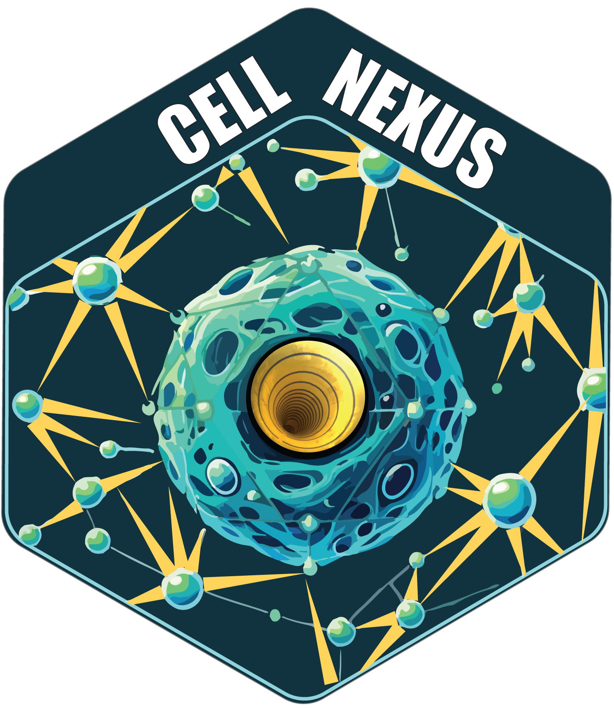
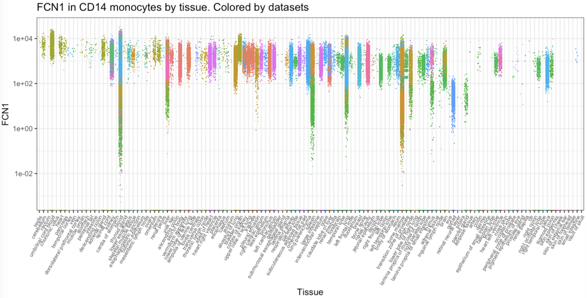

cellNexus
================

<!-- badges: start -->

[](https://lifecycle.r-lib.org/articles/stages.html#maturing)
<!-- badges: end -->

# Introduction

`cellNexus` extends the functionality of `CuratedAtlasQueryR` by
providing a unified interface for querying and accessing the harmonised,
curated, and reannotated the CELLxGENE human cell atlas. It enables
reproducible, programmatic exploration of large-scale single-cell
datasets, supporting data retrieval at the cell, sample, and dataset levels
levels with flexible filtering based on tissue, cell type, and experimental
condition, and other metadata. Retrieved data are returned in formats
ready for downstream analysis.

The package integrates over 44 million human cells processed through a
standardised pipeline, including consistent quality control,
normalisation, and unified abundance representations (e.g., single-cell,
counts-per-million, normalised expression, and pseudobulk). This
harmonisation facilitates efficient cross-dataset comparison and
integration.

Data are hosted on the ARDC Nectar Research Cloud, and most functions
access them via web requests; therefore, an active network connection is required
required for typical use.

While both cellNexus and CuratedAtlasQueryR rely on precomputed
expression layers, cellNexus adopts a more standardised and transparent
processing workflow. This includes explicit removal of empty droplets
and dead cells, followed by harmonised quality control, normalisation,
and multi-layer data generation, ensuring alignment with evolving
CELLxGENE releases.




# Query interface

## Installation

``` r
devtools::install_github("MangiolaLaboratory/cellNexus")
```

## Load the package

``` r
library(cellNexus)
```

## Load additional packages

``` r
suppressPackageStartupMessages({
  library(ggplot2)
})
```

## Load and explore the metadata

### Load the metadata

By default, `get_metadata()` loads harmonised annotations. Users can
retrieve original Census annotations by the function
`join_census_table()`.

``` r
metadata <- get_metadata() |>
  join_census_table()
metadata
```

    #> # Source:   SQL [?? x 76]
    #> # Database: DuckDB 1.4.3 [unknown@Linux 5.14.0-362.24.1.el9_3.x86_64:R 4.5.3/:memory:]
    #>    cell_id observation_joinid dataset_id         sample_id sample_ experiment___ run_from_cell_id sample_heuristic age_days
    #>      <dbl> <chr>              <chr>              <chr>     <chr>   <chr>         <chr>            <chr>               <int>
    #>  1      14 qxl7HJjL$L         842c6f5d-4a94-4ee… 1119f482… 1119f4… ""            <NA>             182a61cc-b041-4…    14600
    #>  2      15 TjgA2vJ1;{         842c6f5d-4a94-4ee… 1119f482… 1119f4… ""            <NA>             182a61cc-b041-4…    14600
    #>  3      16 j}0<Y>a#X~         842c6f5d-4a94-4ee… 1119f482… 1119f4… ""            <NA>             182a61cc-b041-4…    14600
    #>  4      17 QRMCN*8*|#         842c6f5d-4a94-4ee… 1119f482… 1119f4… ""            <NA>             182a61cc-b041-4…    14600
    #>  5      18 h22!#$}SJ*         842c6f5d-4a94-4ee… 1119f482… 1119f4… ""            <NA>             182a61cc-b041-4…    14600
    #>  6      19 lNmuO5xs~3         842c6f5d-4a94-4ee… 1119f482… 1119f4… ""            <NA>             182a61cc-b041-4…    14600
    #>  7      20 6Eu5c&aEH;         842c6f5d-4a94-4ee… 1119f482… 1119f4… ""            <NA>             182a61cc-b041-4…    14600
    #>  8       5 N>_|{;6_6N         842c6f5d-4a94-4ee… 1f755b9b… 1f755b… ""            <NA>             9ca47fe5-873e-4…    14600
    #>  9       2 $jvBt8wHSK         842c6f5d-4a94-4ee… 1f755b9b… 1f755b… ""            <NA>             9ca47fe5-873e-4…    14600
    #> 10       3 5jp7Uu{#@#         842c6f5d-4a94-4ee… 1f755b9b… 1f755b… ""            <NA>             9ca47fe5-873e-4…    14600
    #> # ℹ more rows
    #> # ℹ 67 more variables: tissue_groups <chr>, nFeature_expressed_in_sample <int>, nCount_RNA <dbl>, empty_droplet <lgl>,
    #> #   cell_type_unified_ensemble <chr>, is_immune <lgl>, subsets_Mito_percent <int>, subsets_Ribo_percent <int>,
    #> #   high_mitochondrion <lgl>, high_ribosome <lgl>, scDblFinder.class <chr>, sample_chunk <int>, cell_chunk <int>,
    #> #   sample_pseudobulk_chunk <int>, file_id_cellNexus_single_cell <chr>, file_id_cellNexus_pseudobulk <chr>,
    #> #   count_upper_bound <dbl>, nfeature_expressed_thresh <dbl>, inverse_transform <chr>, alive <lgl>,
    #> #   cell_annotation_blueprint_singler <chr>, cell_annotation_monaco_singler <chr>, cell_annotation_azimuth_l2 <chr>, …

Metadata is saved to `get_default_cache_dir()` unless a custom path is
provided via the cache_directory argument. The `metadata` variable can
then be re-used for all subsequent queries.

### Explore the tissue

``` r
metadata |>
  dplyr::distinct(tissue, cell_type_unified_ensemble)
#> # Source:   SQL [?? x 2]
#> # Database: DuckDB 1.4.3 [unknown@Linux 5.14.0-362.24.1.el9_3.x86_64:R 4.5.3/:memory:]
#>    tissue           cell_type_unified_ensemble
#>    <chr>            <chr>                     
#>  1 breast           cd16 mono                 
#>  2 breast           cd14 mono                 
#>  3 cortex of kidney monocytic                 
#>  4 cortex of kidney other                     
#>  5 blood            cd4 th1 em                
#>  6 blood            t cd4                     
#>  7 blood            nk                        
#>  8 breast           macrophage                
#>  9 blood            erythrocyte               
#> 10 blood            cd8 naive                 
#> # ℹ more rows
```

## Quality control

cellNexus metadata applies standardised quality control to filter out
empty droplets, dead or damaged cells, doublets, and samples with low
gene counts.

``` r
metadata <- metadata |>
  keep_quality_cells()

metadata <- metadata |>
  dplyr::filter(feature_count >= 5000)
```

## Download single-cell RNA sequencing counts

### Query raw counts

``` r
single_cell_counts <-
  metadata |>
  dplyr::filter(
    self_reported_ethnicity == "African American" &
      assay == "10x 3' v3" &
      tissue == "breast" &
      cell_type == "T cell"
  ) |>
  get_single_cell_experiment()
#> ℹ Realising metadata.
#> ℹ Synchronising files
#> ℹ Reading files.
#> ℹ Compiling Experiment.

single_cell_counts
#> class: SingleCellExperiment 
#> dim: 33145 3 
#> metadata(0):
#> assays(1): counts
#> rownames(33145): ENSG00000243485 ENSG00000237613 ... ENSG00000277475 ENSG00000268674
#> rowData names(0):
#> colnames(3): 1_1 2_1 3_1
#> colData names(76): observation_joinid dataset_id ... tissue_ontology_term_id original_cell_
#> reducedDimNames(0):
#> mainExpName: NULL
#> altExpNames(0):
```

### Query counts scaled per million

``` r
single_cell_cpm <-
  metadata |>
  dplyr::filter(
    self_reported_ethnicity == "African American" &
      assay == "10x 3' v3" &
      tissue == "breast" &
      cell_type == "T cell"
  ) |>
  get_single_cell_experiment(assays = "cpm")
#> ℹ Realising metadata.
#> ℹ Synchronising files
#> ℹ Reading files.
#> ℹ Compiling Experiment.

single_cell_cpm
#> class: SingleCellExperiment 
#> dim: 33145 3 
#> metadata(0):
#> assays(1): cpm
#> rownames(33145): ENSG00000243485 ENSG00000237613 ... ENSG00000277475 ENSG00000268674
#> rowData names(0):
#> colnames(3): 1_1 2_1 3_1
#> colData names(76): observation_joinid dataset_id ... tissue_ontology_term_id original_cell_
#> reducedDimNames(0):
#> mainExpName: NULL
#> altExpNames(0):
```

### Query SCT normalised counts

``` r
single_cell_sct <-
  metadata |>
  dplyr::filter(
    self_reported_ethnicity == "African American" &
      assay == "10x 3' v3" &
      tissue == "breast" &
      cell_type == "T cell"
  ) |>
  get_single_cell_experiment(assays = "sct")
#> ℹ Realising metadata.
#> ℹ Synchronising files
#> ℹ Reading files.
#> ℹ Compiling Experiment.

single_cell_sct
#> class: SingleCellExperiment 
#> dim: 33145 3 
#> metadata(0):
#> assays(1): sct
#> rownames(33145): ENSG00000243485 ENSG00000237613 ... ENSG00000277475 ENSG00000268674
#> rowData names(0):
#> colnames(3): 1_1 2_1 3_1
#> colData names(76): observation_joinid dataset_id ... tissue_ontology_term_id original_cell_
#> reducedDimNames(0):
#> mainExpName: NULL
#> altExpNames(0):
```

### Query pseudobulk

``` r
pseudobulk_counts <-
  metadata |>
  dplyr::filter(
    assay == "10x 5' v1" &
      tissue == "lung" &
      cell_type == "classical monocyte"
  ) |>
  get_pseudobulk()
#> ℹ Realising metadata.
#> ℹ Synchronising files
#> ℹ Reading files.
#> ℹ Compiling Experiment.

pseudobulk_counts
#> class: SingleCellExperiment 
#> dim: 19979 1 
#> metadata(0):
#> assays(1): counts
#> rownames(19979): ENSG00000243485 ENSG00000238009 ... ENSG00000275063 ENSG00000271254
#> rowData names(0):
#> colnames(1): 2e8c9911c9bfbffc07288adef93d3cf2___cd14 mono
#> colData names(59): dataset_id sample_id ... tissue_ontology_term_id sample_identifier
#> reducedDimNames(0):
#> mainExpName: NULL
#> altExpNames(0):
```

## Download cell communication metadata

Cell communication metadata was generated based on post-QC cells per
sample using `CellChat v2` method. It uses our harmonised cell type
annotation (cell_type_unified_ensemble) to infer the communication. It
captures inferred communication at both the ligand–receptor pair level
and the signalling pathway level.

- interaction_count: The number of inferred interactions between each
  pair of cell groups.

- interaction_weight: The aggregated communication strength between each
  pair of cell groups.

For definitions of additional annotations, please refer to the CellChat
v2 documentation: <https://github.com/jinworks/CellChat>.

``` r
get_cell_communication_strength()
```

    #> # Source:   SQL [?? x 16]
    #> # Database: DuckDB 1.4.3 [unknown@Linux 5.14.0-362.24.1.el9_3.x86_64:R 4.5.3/:memory:]
    #>   source    target ligand receptor   lr_prob lr_pval interaction_name   interaction_name_2 pathway_name annotation evidence
    #>   <chr>     <chr>  <chr>  <chr>        <dbl>   <dbl> <chr>              <chr>              <chr>        <chr>      <chr>   
    #> 1 b         b      TGFB1  TGFbR1_R2 0.000116    1    TGFB1_TGFBR1_TGFB… TGFB1 - (TGFBR1+T… TGFb         Secreted … KEGG: h…
    #> 2 b memory  b      TGFB1  TGFbR1_R2 0.000865    1    TGFB1_TGFBR1_TGFB… TGFB1 - (TGFBR1+T… TGFb         Secreted … KEGG: h…
    #> 3 b naive   b      TGFB1  TGFbR1_R2 0.000696    0.99 TGFB1_TGFBR1_TGFB… TGFB1 - (TGFBR1+T… TGFb         Secreted … KEGG: h…
    #> 4 cd14 mono b      TGFB1  TGFbR1_R2 0.00240     0.81 TGFB1_TGFBR1_TGFB… TGFB1 - (TGFBR1+T… TGFb         Secreted … KEGG: h…
    #> 5 cd4 naive b      TGFB1  TGFbR1_R2 0.000957    1    TGFB1_TGFBR1_TGFB… TGFB1 - (TGFBR1+T… TGFb         Secreted … KEGG: h…
    #> 6 cd4 tem   b      TGFB1  TGFbR1_R2 0.00242     0.76 TGFB1_TGFBR1_TGFB… TGFB1 - (TGFBR1+T… TGFb         Secreted … KEGG: h…
    #> # ℹ 5 more variables: pathway_prob <dbl>, pathway_pval <dbl>, sample_id <chr>, interaction_count <dbl>,
    #> #   interaction_weight <dbl>

### Extract only a subset of genes

This is helpful if just few genes are of interest (e.g ENSG00000134644
(PUM1)), as they can be compared across samples. cellNexus uses ENSEMBL
gene ID(s).

``` r
single_cell_cpm <-
  metadata |>
  dplyr::filter(
    self_reported_ethnicity == "African American" &
      assay == "10x 3' v3" &
      tissue == "breast" &
      cell_type == "T cell"
  ) |>
  get_single_cell_experiment(assays = "cpm", features = "ENSG00000134644")
#> ℹ Realising metadata.
#> ℹ Synchronising files
#> ℹ Reading files.
#> ℹ Compiling Experiment.

single_cell_cpm
#> class: SingleCellExperiment 
#> dim: 1 3 
#> metadata(0):
#> assays(1): cpm
#> rownames(1): ENSG00000134644
#> rowData names(0):
#> colnames(3): 1_1 2_1 3_1
#> colData names(76): observation_joinid dataset_id ... tissue_ontology_term_id original_cell_
#> reducedDimNames(0):
#> mainExpName: NULL
#> altExpNames(0):
```

### Extract the counts as a Seurat object

This convert the H5 SingleCellExperiment to Seurat so it might take long
time and occupy a lot of memory depending on how many cells you are
requesting.

``` r
seurat_counts <-
  metadata |>
  dplyr::filter(
    self_reported_ethnicity == "African American" &
      assay == "10x 3' v3" &
      tissue == "breast" &
      cell_type == "T cell"
  ) |>
  get_seurat()
#> ℹ Realising metadata.
#> ℹ Synchronising files
#> ℹ Reading files.
#> ℹ Compiling Experiment.

seurat_counts
#> An object of class Seurat 
#> 33145 features across 3 samples within 1 assay 
#> Active assay: originalexp (33145 features, 0 variable features)
#>  2 layers present: counts, data
```

By default, data is downloaded to `get_default_cache_dir()` output. If
memory is a concern, users can specify a custom cache directory to
metadata and counts functions:

## Load metadata from the custom cache directory

``` r
metadata <- get_metadata(cache_directory = "/MY/CUSTOM/PATH")
```

## Query raw counts from the custom cache directory

``` r
single_cell_counts <-
  metadata |>
  dplyr::filter(
    self_reported_ethnicity == "African American" &
      assay == "10x 3' v3" &
      tissue == "breast" &
      cell_type == "T cell"
  ) |>
  get_single_cell_experiment(cache_directory = "/MY/CUSTOM/PATH")

single_cell_counts
```

Same strategy can be applied for functions `get_pseuodbulk()` and
`get_seurat()` by passing your custom directory character to
“cache_directory” parameter.

## Save your `SingleCellExperiment`

The returned `SingleCellExperiment` can be saved with three modalities,
as `.rds` or as `HDF5` or as `H5AD`.

### Saving as RDS (fast saving, slow reading)

Saving as `.rds` has the advantage of being fast, and the `.rds` file
occupies very little disk space as it only stores the links to the files
in your cache.

However it has the disadvantage that for big `SingleCellExperiment`
objects, which merge a lot of HDF5 from your
`get_single_cell_experiment`, the display and manipulation is going to
be slow. In addition, an `.rds` saved in this way is not portable: you
will not be able to share it with other users.

``` r
single_cell_counts |>
  saveRDS("single_cell_counts.rds")
```

### Saving as HDF5 (slow saving, fast reading)

Saving as `.hdf5` executes any computation on the `SingleCellExperiment`
and writes it to disk as a monolithic `HDF5`. Once this is done,
operations on the `SingleCellExperiment` will be comparatively very
fast. The resulting `.hdf5` file will also be totally portable and
sharable.

However this `.hdf5` has the disadvantage of being larger than the
corresponding `.rds` as it includes a copy of the count information, and
the saving process is going to be slow for large objects.

``` r
# ! IMPORTANT if you save 200K+ cells
HDF5Array::setAutoBlockSize(size = 1e+09)

single_cell_counts |>
  HDF5Array::saveHDF5SummarizedExperiment(
    "single_cell_counts",
    replace = TRUE,
    as.sparse = TRUE,
    verbose = TRUE
  )
```

### Saving as H5AD (slow saving, fast reading)

Saving as `.h5ad` executes any computation on the `SingleCellExperiment`
and writes it to disk as a monolithic `H5AD`. The `H5AD` format is the
HDF5 disk representation of the AnnData object and is well-supported in
Python.

However this `.h5ad` saving strategy has a bottleneck of handling
columns with only NA values of a `SingleCellExperiment` metadata.

``` r
# ! IMPORTANT if you save 200K+ cells
HDF5Array::setAutoBlockSize(size = 1e+09)

single_cell_counts |>
  anndataR::write_h5ad("single_cell_counts.h5ad",
    compression = "gzip",
    verbose = TRUE
  )
```

## Visualise gene transcription

We can gather all CD14 monocytes cells and plot the distribution of
ENSG00000085265 (FCN1) across all tissues

``` r
# Plots with styling
counts <- metadata |>
  # Filter and subset
  dplyr::filter(cell_type_unified_ensemble == "cd14 mono") |>
  # Get counts per million for FCN1 gene
  get_single_cell_experiment(assays = "cpm", features = "ENSG00000085265") |>
  suppressMessages() |>
  # Add feature to table
  tidySingleCellExperiment::join_features("ENSG00000085265", shape = "wide") |>
  # Rank x axis
  tibble::as_tibble() |>
  # Rename to gene symbol
  dplyr::rename(FCN1 = ENSG00000085265)

# Plot by disease
counts |>
  dplyr::with_groups(disease, ~ .x |>
    dplyr::mutate(median_count = median(`FCN1`, rm.na = TRUE))) |>
  # Plot
  ggplot(aes(forcats::fct_reorder(disease, median_count, .desc = TRUE), `FCN1`, color = dataset_id)) +
  geom_jitter(shape = ".") +

  # Style
  guides(color = "none") +
  scale_y_log10() +
  theme_bw() +
  theme(axis.text.x = element_text(angle = 60, vjust = 1, hjust = 1)) +
  xlab("Disease") +
  ggtitle("FCN1 in CD14 monocytes by disease. Coloured by datasets")
```

<!-- -->

``` r
# Plot by tissue
counts |>
  dplyr::with_groups(tissue, ~ .x |>
    dplyr::mutate(median_count = median(`FCN1`, rm.na = TRUE))) |>
  # Plot
  ggplot(aes(
    forcats::fct_reorder(tissue,
      median_count,
      .desc = TRUE
    ),
    `FCN1`,
    color = dataset_id
  )) +
  geom_jitter(shape = ".") +

  # Style
  guides(color = "none") +
  scale_y_log10() +
  theme_bw() +
  theme(axis.text.x = element_text(angle = 60, vjust = 1, hjust = 1)) +
  xlab("Tissue") +
  ggtitle("FCN1 in CD14 monocytes by tissue. Colored by datasets") +
  theme(legend.position = "none", axis.text.x = element_text(size = 6.5))
```

<!-- -->

## Integrate cloud and local metadata

`cellNexus` not only enables users to query our metadata but also allows
integration with your local metadata. Additionally, users can integrate
with your metadata stored in the cloud.

To enable this feature, users must include
`file_id_cellNexus_single_cell` and `atlas_id` (e.g cellxgene/dd-mm-yy)
columns in the metadata. See metadata structure in cellNexus::pbmc3k_sce

``` r
# Set up local cache and paths
local_cache <- tempdir()
layer <- "counts"
meta_path <- file.path(local_cache, "pbmc3k_metadata.parquet")
data(pbmc3k_sce)

# Extract and prepare metadata
pbmc3k_metadata <- pbmc3k_sce |>
  S4Vectors::metadata() |>
  purrr::pluck("data") |>
  dplyr::mutate(
    counts_directory = file.path(tempdir(), atlas_id, layer),
    sce_path = file.path(counts_directory, file_id_cellNexus_single_cell)
  )

# Get unique paths
counts_directory <- pbmc3k_metadata |>
  dplyr::pull(counts_directory) |>
  unique()

sce_path <- pbmc3k_metadata |>
  dplyr::pull(sce_path) |>
  unique()

# Create directory structure
dir.create(counts_directory, recursive = TRUE, showWarnings = FALSE)

# Save data to disk
pbmc3k_sce |>
  S4Vectors::metadata() |>
  purrr::pluck("data") |>
  arrow::write_parquet(meta_path)

# Save SCE object
pbmc3k_sce |>
  anndataR::write_h5ad(sce_path, compression = "gzip", mode = "w")
```

``` r
# A cellNexus file
file_id_from_cloud <- "e52795dec7b626b6276b867d55328d9f___1.h5ad"
file_id_local <- basename(sce_path)

get_metadata(
  cloud_metadata = METADATA_URL,
  local_metadata = meta_path,
  cache_directory = local_cache
) |>
  # For illustration purpose, only filter a selected cloud metadata and the saved metadata
  dplyr::filter(file_id_cellNexus_single_cell %in% c(file_id_from_cloud, file_id_local)) |>
  dplyr::select(cell_id, sample_id, dataset_id, cell_type_unified_ensemble, atlas_id, file_id_cellNexus_single_cell) |>
  get_single_cell_experiment(cache_directory = local_cache)
#> ℹ Realising metadata.
#> ℹ Synchronising files
#> ℹ Reading files.
#> ℹ Compiling Experiment.
#> class: SingleCellExperiment 
#> dim: 13132 500 
#> metadata(1): data
#> assays(1): counts
#> rownames(13132): ENSG00000228463 ENSG00000228327 ... ENSG00000273748 ENSG00000278384
#> rowData names(0):
#> colnames(500): AAACATACAACCAC_1 AAACATTGAGCTAC_1 ... AGGAGTCTTGTCAG_1 AGGATAGACATTTC_1
#> colData names(6): sample_id dataset_id ... file_id_cellNexus_single_cell original_cell_
#> reducedDimNames(0):
#> mainExpName: NULL
#> altExpNames(0):
```

# Cell metadata

The complete metadata dictionary for the harmonised fields is available
on the documentation site: [cellNexus
documentation](https://cellnexus.org/).

# RNA abundance

The `counts` assay represents RNA abundance on the positive real scale,
without non-linear transformations (e.g., log or square root). In the
original CELLxGENE data, values were provided using a mix of scales and
transformations. The method required to invert these transformations is
recorded in `inverse_transform` column.

The `cpm` assay includes counts per million.

The `sct` assay includes normalised counts by `sctranform`.

# Other representations

The `rank` assay is the representation of each cell’s gene expression
profile where genes are ranked by expression intensity using
`singscore`.

The `pseudobulk` assay includes aggregated RNA abundance for sample and
cell type combination.

The detailed documentation for RNA abundance is available on the
documentation site: [cellNexus documentation](https://cellnexus.org/).

# Session Info

``` r
sessionInfo()
#> R version 4.5.3 (2026-03-11)
#> Platform: x86_64-pc-linux-gnu
#> Running under: Red Hat Enterprise Linux 9.3 (Plow)
#> 
#> Matrix products: default
#> BLAS:   /stornext/System/data/software/rhel/9/base/tools/R/4.5.3/lib64/R/lib/libRblas.so 
#> LAPACK: /stornext/System/data/software/rhel/9/base/tools/R/4.5.3/lib64/R/lib/libRlapack.so;  LAPACK version 3.12.1
#> 
#> locale:
#>  [1] LC_CTYPE=en_US.UTF-8       LC_NUMERIC=C               LC_TIME=en_US.UTF-8        LC_COLLATE=en_US.UTF-8    
#>  [5] LC_MONETARY=en_US.UTF-8    LC_MESSAGES=en_US.UTF-8    LC_PAPER=en_US.UTF-8       LC_NAME=C                 
#>  [9] LC_ADDRESS=C               LC_TELEPHONE=C             LC_MEASUREMENT=en_US.UTF-8 LC_IDENTIFICATION=C       
#> 
#> time zone: Australia/Melbourne
#> tzcode source: system (glibc)
#> 
#> attached base packages:
#> [1] stats     graphics  grDevices utils     datasets  methods   base     
#> 
#> other attached packages:
#> [1] ggplot2_4.0.2     BiocStyle_2.38.0  cellNexus_0.99.20 dplyr_1.2.1      
#> 
#> loaded via a namespace (and not attached):
#>   [1] RcppAnnoy_0.0.23            splines_4.5.3               later_1.4.8                 filelock_1.0.3             
#>   [5] R.oo_1.27.1                 tibble_3.3.1                polyclip_1.10-7             fastDummies_1.7.5          
#>   [9] lifecycle_1.0.5             rprojroot_2.1.1             globals_0.19.1              lattice_0.22-9             
#>  [13] MASS_7.3-65                 backports_1.5.1             magrittr_2.0.5              plotly_4.12.0              
#>  [17] sass_0.4.10                 rmarkdown_2.31              yaml_2.3.12                 jquerylib_0.1.4            
#>  [21] httpuv_1.6.17               otel_0.2.0                  Seurat_5.4.0                sctransform_0.4.3          
#>  [25] spam_2.11-3                 sp_2.2-1                    sessioninfo_1.2.3           pkgbuild_1.4.8             
#>  [29] spatstat.sparse_3.1-0       reticulate_1.46.0           cowplot_1.2.0               pbapply_1.7-4              
#>  [33] DBI_1.3.0                   RColorBrewer_1.1-3          abind_1.4-8                 pkgload_1.5.1              
#>  [37] R.cache_0.17.0              Rtsne_0.17                  GenomicRanges_1.62.1        R.utils_2.13.0             
#>  [41] purrr_1.2.2                 BiocGenerics_0.56.0         styler_1.11.0               IRanges_2.44.0             
#>  [45] S4Vectors_0.49.1-1          ggrepel_0.9.8               irlba_2.3.7                 listenv_0.10.1             
#>  [49] spatstat.utils_3.2-2        testthat_3.3.2              goftest_1.2-3               RSpectra_0.16-2            
#>  [53] spatstat.random_3.4-5       fitdistrplus_1.2-6          parallelly_1.46.1           commonmark_2.0.0           
#>  [57] codetools_0.2-20            DelayedArray_0.36.1         xml2_1.5.2                  tidyselect_1.2.1           
#>  [61] rclipboard_0.2.1            UCSC.utils_1.6.1            farver_2.1.2                shinyWidgets_0.9.1         
#>  [65] matrixStats_1.5.0           stats4_4.5.3                spatstat.explore_3.8-0      duckdb_1.4.3               
#>  [69] Seqinfo_1.0.0               roxygen2_7.3.3              jsonlite_2.0.0              ellipsis_0.3.3             
#>  [73] progressr_0.19.0            ggridges_0.5.7              survival_3.8-6              tools_4.5.3                
#>  [77] ica_1.0-3                   Rcpp_1.1.1-1                glue_1.8.0                  gridExtra_2.3              
#>  [81] SparseArray_1.10.10         xfun_0.57                   MatrixGenerics_1.22.0       usethis_3.2.1              
#>  [85] GenomeInfoDb_1.46.2         HDF5Array_1.38.0            withr_3.0.2                 BiocManager_1.30.27        
#>  [89] fastmap_1.2.0               basilisk_1.22.0             rhdf5filters_1.22.0         digest_0.6.39              
#>  [93] R6_2.6.1                    mime_0.13                   scattermore_1.2             tensor_1.5.1               
#>  [97] spatstat.data_3.1-9         R.methodsS3_1.8.2           h5mread_1.2.1               utf8_1.2.6                 
#> [101] tidyr_1.3.2                 generics_0.1.4              data.table_1.18.2.1         httr_1.4.8                 
#> [105] htmlwidgets_1.6.4           S4Arrays_1.10.1             uwot_0.2.4                  pkgconfig_2.0.3            
#> [109] gtable_0.3.6                rsconnect_1.8.0             blob_1.3.0                  lmtest_0.9-40              
#> [113] S7_0.2.1-1                  SingleCellExperiment_1.32.0 XVector_0.50.0              brio_1.1.5                 
#> [117] htmltools_0.5.9             bookdown_0.46               dotCall64_1.2               SeuratObject_5.4.0         
#> [121] scales_1.4.0                Biobase_2.70.0              png_0.1-9                   spatstat.univar_3.1-7      
#> [125] knitr_1.51                  rstudioapi_0.18.0           reshape2_1.4.5              checkmate_2.3.4            
#> [129] nlme_3.1-168                curl_7.0.0                  anndataR_1.0.2              rhdf5_2.54.1               
#> [133] cachem_1.1.0                zoo_1.8-15                  stringr_1.6.0               KernSmooth_2.23-26         
#> [137] parallel_4.5.3              miniUI_0.1.2                arrow_23.0.1.2              zellkonverter_1.20.1       
#> [141] desc_1.4.3                  pillar_1.11.1               grid_4.5.3                  vctrs_0.7.3                
#> [145] RANN_2.6.2                  promises_1.5.0              dbplyr_2.5.2                xtable_1.8-8               
#> [149] cluster_2.1.8.2             evaluate_1.0.5              cli_3.6.6                   compiler_4.5.3             
#> [153] rlang_1.2.0                 future.apply_1.20.2         plyr_1.8.9                  fs_2.0.1                   
#> [157] stringi_1.8.7               viridisLite_0.4.3           deldir_2.0-4                assertthat_0.2.1           
#> [161] lazyeval_0.2.3              devtools_2.5.0              spatstat.geom_3.7-3         Matrix_1.7-4               
#> [165] dir.expiry_1.18.0           RcppHNSW_0.6.0              patchwork_1.3.2             bit64_4.6.0-1              
#> [169] future_1.70.0               Rhdf5lib_1.32.0             shiny_1.13.0                SummarizedExperiment_1.40.0
#> [173] ROCR_1.0-12                 igraph_2.2.3                memoise_2.0.1               bslib_0.10.0               
#> [177] bit_4.6.0
```
