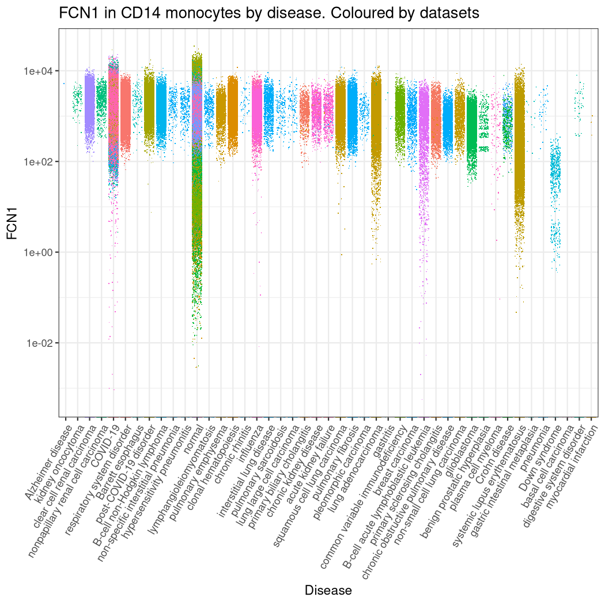
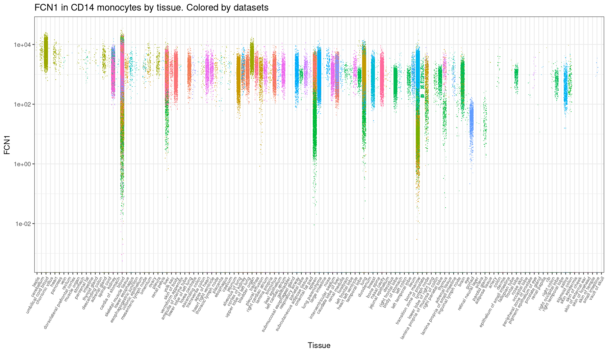

cellNexus
================
Mangiola et al.

<!-- badges: start -->

[](https://lifecycle.r-lib.org/articles/stages.html#maturing)
<!-- badges: end -->

# Introduction

Minimal vignette stub for fast README / figure-layout iteration. Use
`source("vignettes/temp_precompile.R")` from the package root.


## Sample plot

``` r
plot(1:10, main = "temp precompile plot")
```

 
