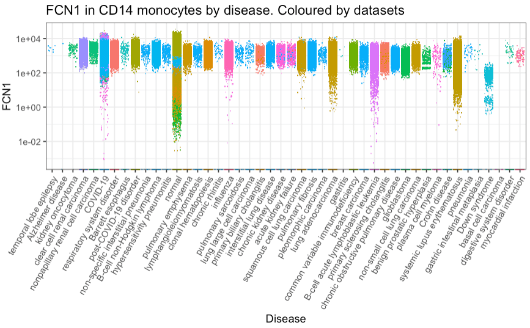

# cellNexus

[](https://lifecycle.r-lib.org/articles/stages.html#maturing)

## Introduction

`cellNexus` builds upon and extends the functionality of the previously
released `CuratedAtlasQueryR`, providing a unified query and access
interface to the harmonised, curated, and reannotated CELLxGENE human
cell atlas. It enables reproducible and programmatic exploration of
large-scale single-cell data resources, supporting retrieval at the
cell, sample, and dataset levels through flexible filtering by tissue,
cell type, experimental condition, or other metadata features. The
retrieved data are returned for downstream analysis.

`cellNexus` integrates over 40 million human cells processed with
standardised quality control, consistent normalisation, and unified
abundance representations—including single-cell, counts-per-million,
normalised expression, and pseudobulk layers. This harmonised design
facilitates efficient cross-dataset analyses and downstream integration.

Data are hosted on the ARDC Nectar Research Cloud, and most `cellNexus`
functions interact with Nectar via web requests, so a network connection
is required for most functionality.

`cellNexus` builds on top of package CuratedAtlasQueryR. While both rely
on pre-computed expression layers, they differ in how these layers are
generated. cellNexus implements a more standardised workflow, including
explicit removal of empty droplets and dead cells, followed by
harmonised quality control, normalisation, and multi-layer data
generation. Through this process, it produces updated datasets that
remain aligned with the evolving CELLxGENE releases.


## Query interface

### Installation

``` r
devtools::install_github("MangiolaLaboratory/cellNexus")
```

### Load the package

``` r
library(cellNexus)
```

### Load additional packages

``` r
suppressPackageStartupMessages({
  library(ggplot2)
})
```

### Load and explore the metadata

#### Load the metadata

``` r
metadata <- get_metadata()
metadata
```

    #> ℹ Downloading 1 file, totalling 0 GB
    #> ℹ Downloading https://object-store.rc.nectar.org.au/v1/AUTH_06d6e008e3e642da99d806ba3ea629c5/cellNexus-metadata/sample_metadata.2.1.0.parquet to /tmp/RtmpwHr5Dk/sample_metadata.2.1.0.parquet
    #> # Source:   SQL [?? x 73]
    #> # Database: DuckDB 1.5.1 [unknown@Linux 6.17.0-1010-azure:R 4.5.3/:memory:]
    #>    cell_id dataset_id   observation_joinid sample_id sample_ cell_count citation
    #>      <dbl> <chr>        <chr>              <chr>     <chr>        <int> <chr>   
    #>  1      81 cda2c8cd-be… *NUPW@J{c2         034f0fb1… 034f0f…     255901 Publica…
    #>  2      82 cda2c8cd-be… KIV>qGFIS?         034f0fb1… 034f0f…     255901 Publica…
    #>  3      83 cda2c8cd-be… p5e=WoIq0d         034f0fb1… 034f0f…     255901 Publica…
    #>  4      84 cda2c8cd-be… I6>u{Gb-J_         034f0fb1… 034f0f…     255901 Publica…
    #>  5      85 cda2c8cd-be… lx`7Bo-&7n         034f0fb1… 034f0f…     255901 Publica…
    #>  6      87 cda2c8cd-be… -NL-OH3!IA         034f0fb1… 034f0f…     255901 Publica…
    #>  7      88 cda2c8cd-be… zHCZWNmUHu         034f0fb1… 034f0f…     255901 Publica…
    #>  8      89 cda2c8cd-be… *_#lQ<oUnT         034f0fb1… 034f0f…     255901 Publica…
    #>  9      86 cda2c8cd-be… 6mRCZW}rOM         034f0fb1… 034f0f…     255901 Publica…
    #> 10      99 cda2c8cd-be… IdHwp1GBZm         03ddfd57… 03ddfd…     255901 Publica…
    #> # ℹ more rows
    #> # ℹ 66 more variables: collection_id <chr>, dataset_version_id <chr>,
    #> #   default_embedding <chr>, experiment___ <chr>, explorer_url <chr>,
    #> #   feature_count <int>, filesize <dbl>, filetype <chr>,
    #> #   mean_genes_per_cell <dbl>, primary_cell_count <chr>, published_at <chr>,
    #> #   raw_data_location <chr>, revised_at <chr>, run_from_cell_id <chr>,
    #> #   sample_heuristic <chr>, schema_version <chr>, suspension_type <chr>, …

Metadata is saved to
[`get_default_cache_dir()`](https://mangiolalaboratory.github.io/cellNexus/reference/get_default_cache_dir.md)
unless a custom path is provided via the cache_directory argument. The
`metadata` variable can then be re-used for all subsequent queries.

#### Explore the tissue

``` r
metadata |>
  dplyr::distinct(tissue, cell_type_unified_ensemble)
#> # Source:   SQL [?? x 2]
#> # Database: DuckDB 1.5.1 [unknown@Linux 6.17.0-1010-azure:R 4.5.3/:memory:]
#>    tissue               cell_type_unified_ensemble
#>    <chr>                <chr>                     
#>  1 breast               cd14 mono                 
#>  2 lung                 cd4 th2 em                
#>  3 respiratory airway   cd4 th1 em                
#>  4 lung parenchyma      cd4 fh em                 
#>  5 lung                 treg                      
#>  6 heart left ventricle cd14 mono                 
#>  7 blood                nk                        
#>  8 frontal lobe         nk                        
#>  9 lung parenchyma      cd4 tcm                   
#> 10 bone marrow          cd14 mono                 
#> # ℹ more rows
```

### Quality control

cellNexus metadata applies standardised quality control to filter out
empty droplets, dead or damaged cells, doublets, and samples with low
gene counts.

``` r
metadata <- metadata |>
  keep_quality_cells()

metadata <- metadata |>
  dplyr::filter(feature_count >= 5000)
```

### Download single-cell RNA sequencing counts

#### Query raw counts

``` r
single_cell_counts <-
  metadata |>
  dplyr::filter(
    self_reported_ethnicity == "African" &
      assay == "10x 3' v3" &
      tissue == "lung parenchyma" &
      cell_type == "T cell"
  ) |>
  get_single_cell_experiment()
#> ℹ Realising metadata.
#> ℹ Synchronising files
#> ℹ Downloading 2 files, totalling 0.01 GB
#> ℹ Downloading 2 files in parallel...
#> ℹ Reading files.
#> ℹ Compiling Experiment.

single_cell_counts
#> class: SingleCellExperiment 
#> dim: 56239 9 
#> metadata(0):
#> assays(1): counts
#> rownames(56239): ENSG00000121410 ENSG00000268895 ... ENSG00000135605
#>   ENSG00000109501
#> rowData names(0):
#> colnames(9): 76_1 52_1 ... 279_2 43_2
#> colData names(73): dataset_id observation_joinid ...
#>   tissue_ontology_term_id original_cell_
#> reducedDimNames(0):
#> mainExpName: NULL
#> altExpNames(0):
```

#### Query counts scaled per million

``` r
single_cell_cpm <-
  metadata |>
  dplyr::filter(
    self_reported_ethnicity == "African" &
      assay == "10x 3' v3" &
      tissue == "lung parenchyma" &
      cell_type == "T cell"
  ) |>
  get_single_cell_experiment(assays = "cpm")
#> ℹ Realising metadata.
#> ℹ Synchronising files
#> ℹ Downloading 2 files, totalling 0.01 GB
#> ℹ Downloading 2 files in parallel...
#> ℹ Reading files.
#> ℹ Compiling Experiment.

single_cell_cpm
#> class: SingleCellExperiment 
#> dim: 56239 9 
#> metadata(0):
#> assays(1): cpm
#> rownames(56239): ENSG00000121410 ENSG00000268895 ... ENSG00000135605
#>   ENSG00000109501
#> rowData names(0):
#> colnames(9): 76_1 52_1 ... 279_2 43_2
#> colData names(73): dataset_id observation_joinid ...
#>   tissue_ontology_term_id original_cell_
#> reducedDimNames(0):
#> mainExpName: NULL
#> altExpNames(0):
```

#### Query SCT normalised counts

``` r
single_cell_sct <-
  metadata |>
  dplyr::filter(
    self_reported_ethnicity == "African" &
      assay == "10x 3' v3" &
      tissue == "lung parenchyma" &
      cell_type == "T cell"
  ) |>
  get_single_cell_experiment(assays = "sct")
#> ℹ Realising metadata.
#> ℹ Synchronising files
#> ℹ Downloading 2 files, totalling 0.04 GB
#> ℹ Downloading 2 files in parallel...
#> ℹ Reading files.
#> ℹ Compiling Experiment.

single_cell_sct
#> class: SingleCellExperiment 
#> dim: 56239 9 
#> metadata(0):
#> assays(1): sct
#> rownames(56239): ENSG00000121410 ENSG00000268895 ... ENSG00000135605
#>   ENSG00000109501
#> rowData names(0):
#> colnames(9): 76_1 52_1 ... 279_2 43_2
#> colData names(73): dataset_id observation_joinid ...
#>   tissue_ontology_term_id original_cell_
#> reducedDimNames(0):
#> mainExpName: NULL
#> altExpNames(0):
```

#### Query pseudobulk

``` r
pseudobulk_counts <-
  metadata |>
  dplyr::filter(
      assay  == "10x 5' v1" &
      tissue == "lung" &
      cell_type == "classical monocyte"
  ) |>
  get_pseudobulk()
#> ℹ Realising metadata.
#> ℹ Synchronising files
#> ℹ Downloading 1 file, totalling 0 GB
#> ℹ Downloading https://object-store.rc.nectar.org.au/v1/AUTH_06d6e008e3e642da99d806ba3ea629c5/cellNexus-anndata/cellxgene/01-07-2024/pseudobulk/counts/11d9b242ad2fc637e43a23a6b7389fde___1.h5ad to /home/runner/.cache/R/cellNexus/cellxgene/01-07-2024/pseudobulk/counts/11d9b242ad2fc637e43a23a6b7389fde___1.h5ad
#> ℹ Reading files.
#> ℹ Compiling Experiment.

pseudobulk_counts
#> class: SingleCellExperiment 
#> dim: 19979 1 
#> metadata(0):
#> assays(1): counts
#> rownames(19979): ENSG00000243485 ENSG00000238009 ... ENSG00000275063
#>   ENSG00000271254
#> rowData names(0):
#> colnames(1): 2e8c9911c9bfbffc07288adef93d3cf2___cd14 mono
#> colData names(56): dataset_id sample_id ... tissue_ontology_term_id
#>   sample_identifier
#> reducedDimNames(0):
#> mainExpName: NULL
#> altExpNames(0):
```

#### Extract only a subset of genes

This is helpful if just few genes are of interest (e.g ENSG00000134644
(PUM1)), as they can be compared across samples. cellNexus uses ENSEMBL
gene ID(s).

``` r
single_cell_cpm <-
  metadata |>
  dplyr::filter(
    self_reported_ethnicity == "African" &
      assay  == "10x 3' v3" &
      tissue == "lung parenchyma" &
      cell_type == "T cell"
  ) |>
  get_single_cell_experiment(assays = "cpm", features = "ENSG00000134644")
#> ℹ Realising metadata.
#> ℹ Synchronising files
#> ℹ Reading files.
#> ℹ Compiling Experiment.

single_cell_cpm
#> class: SingleCellExperiment 
#> dim: 1 9 
#> metadata(0):
#> assays(1): cpm
#> rownames(1): ENSG00000134644
#> rowData names(0):
#> colnames(9): 76_1 52_1 ... 279_2 43_2
#> colData names(73): dataset_id observation_joinid ...
#>   tissue_ontology_term_id original_cell_
#> reducedDimNames(0):
#> mainExpName: NULL
#> altExpNames(0):
```

#### Extract the counts as a Seurat object

This convert the H5 SingleCellExperiment to Seurat so it might take long
time and occupy a lot of memory depending on how many cells you are
requesting.

``` r
seurat_counts <-
  metadata |>
  dplyr::filter(
    self_reported_ethnicity == "African" &
      assay  == "10x 3' v3" &
      tissue == "lung parenchyma" &
      cell_type == "T cell"
  ) |>
  head() |>
  get_seurat()
#> ℹ Realising metadata.
#> ℹ Synchronising files
#> ℹ Reading files.
#> ℹ Compiling Experiment.

seurat_counts
#> An object of class Seurat 
#> 56239 features across 6 samples within 1 assay 
#> Active assay: originalexp (56239 features, 0 variable features)
#>  2 layers present: counts, data
```

By default, data is downloaded to
[`get_default_cache_dir()`](https://mangiolalaboratory.github.io/cellNexus/reference/get_default_cache_dir.md)
output. If memory is a concern, users can specify a custom cache
directory to metadata and counts functions:

### Load metadata from the custom cache directory

``` r
metadata <- get_metadata(cache_directory = "/MY/CUSTOM/PATH")
```

### Query raw counts from the custom cache directory

``` r
single_cell_counts <-
  metadata |>
  dplyr::filter(
    self_reported_ethnicity == "African" &
      assay  == "10x 3' v3" &
      tissue == "lung parenchyma" &
      cell_type == "T cell"
  ) |>
  get_single_cell_experiment(cache_directory = "/MY/CUSTOM/PATH")

single_cell_counts
```

Same strategy can be applied for functions `get_pseuodbulk()` and
[`get_seurat()`](https://mangiolalaboratory.github.io/cellNexus/reference/get_seurat.md)
by passing your custom directory character to “cache_directory”
parameter.

### Save your `SingleCellExperiment`

The returned `SingleCellExperiment` can be saved with three modalities,
as `.rds` or as `HDF5` or as `H5AD`.

#### Saving as RDS (fast saving, slow reading)

Saving as `.rds` has the advantage of being fast, and the `.rds` file
occupies very little disk space as it only stores the links to the files
in your cache.

However it has the disadvantage that for big `SingleCellExperiment`
objects, which merge a lot of HDF5 from your
`get_single_cell_experiment`, the display and manipulation is going to
be slow. In addition, an `.rds` saved in this way is not portable: you
will not be able to share it with other users.

``` r
single_cell_counts |>
  saveRDS("single_cell_counts.rds")
```

#### Saving as HDF5 (slow saving, fast reading)

Saving as `.hdf5` executes any computation on the `SingleCellExperiment`
and writes it to disk as a monolithic `HDF5`. Once this is done,
operations on the `SingleCellExperiment` will be comparatively very
fast. The resulting `.hdf5` file will also be totally portable and
sharable.

However this `.hdf5` has the disadvantage of being larger than the
corresponding `.rds` as it includes a copy of the count information, and
the saving process is going to be slow for large objects.

``` r
# ! IMPORTANT if you save 200K+ cells
HDF5Array::setAutoBlockSize(size = 1e+09)

single_cell_counts |>
  HDF5Array::saveHDF5SummarizedExperiment(
    "single_cell_counts",
    replace = TRUE,
    as.sparse = TRUE,
    verbose = TRUE
  )
```

#### Saving as H5AD (slow saving, fast reading)

Saving as `.h5ad` executes any computation on the `SingleCellExperiment`
and writes it to disk as a monolithic `H5AD`. The `H5AD` format is the
HDF5 disk representation of the AnnData object and is well-supported in
Python.

However this `.h5ad` saving strategy has a bottleneck of handling
columns with only NA values of a `SingleCellExperiment` metadata.

``` r
# ! IMPORTANT if you save 200K+ cells
HDF5Array::setAutoBlockSize(size = 1e+09)

single_cell_counts |>
  anndataR::write_h5ad("single_cell_counts.h5ad",
    compression = "gzip",
    verbose = TRUE
  )
```

### Visualise gene transcription

We can gather all CD14 monocytes cells and plot the distribution of
ENSG00000085265 (FCN1) across all tissues

``` r
# Plots with styling
counts <- metadata |>
  # Filter and subset
  dplyr::filter(cell_type_unified_ensemble == "cd14 mono") |>
  # Get counts per million for FCN1 gene
  get_single_cell_experiment(assays = "cpm", features = "ENSG00000085265") |>
  suppressMessages() |>
  # Add feature to table
  tidySingleCellExperiment::join_features("ENSG00000085265", shape = "wide") |>
  # Rank x axis
  tibble::as_tibble() |>
  # Rename to gene symbol
  dplyr::rename(FCN1 = ENSG00000085265)

# Plot by disease
counts |>
  dplyr::with_groups(disease, ~ .x |>
    dplyr::mutate(median_count = median(`FCN1`, rm.na = TRUE))) |>
  # Plot
  ggplot(aes(forcats::fct_reorder(disease, median_count, .desc = TRUE), `FCN1`, color = dataset_id)) +
  geom_jitter(shape = ".") +

  # Style
  guides(color = "none") +
  scale_y_log10() +
  theme_bw() +
  theme(axis.text.x = element_text(angle = 60, vjust = 1, hjust = 1)) +
  xlab("Disease") +
  ggtitle("FCN1 in CD14 monocytes by disease. Coloured by datasets")
```



``` r
# Plot by tissue
counts |>
  dplyr::with_groups(tissue, ~ .x |>
    dplyr::mutate(median_count = median(`FCN1`, rm.na = TRUE))) |>
  # Plot
  ggplot(aes(
    forcats::fct_reorder(tissue,
      median_count,
      .desc = TRUE
    ),
    `FCN1`,
    color = dataset_id
  )) +
  geom_jitter(shape = ".") +

  # Style
  guides(color = "none") +
  scale_y_log10() +
  theme_bw() +
  theme(axis.text.x = element_text(angle = 60, vjust = 1, hjust = 1)) +
  xlab("Tissue") +
  ggtitle("FCN1 in CD14 monocytes by tissue. Colored by datasets") +
  theme(legend.position = "none", axis.text.x = element_text(size = 6.5))
```


### Integrate cloud and local metadata

`cellNexus` not only enables users to query our metadata but also allows
integration with your local metadata. Additionally, users can integrate
with your metadata stored in the cloud.

To enable this feature, users must include
`file_id_cellNexus_single_cell` and `atlas_id` (e.g cellxgene/dd-mm-yy)
columns in the metadata. See metadata structure in cellNexus::pbmc3k_sce

``` r
# Set up local cache and paths
local_cache <- tempdir()
layer <- "counts"
meta_path <- file.path(local_cache, "pbmc3k_metadata.parquet")
data(pbmc3k_sce)

# Extract and prepare metadata
pbmc3k_metadata <- pbmc3k_sce |>
  S4Vectors::metadata() |>
  purrr::pluck("data") |>
  dplyr::mutate(
    counts_directory = file.path(tempdir(), atlas_id, layer),
    sce_path = file.path(counts_directory, file_id_cellNexus_single_cell)
  )

# Get unique paths
counts_directory <- pbmc3k_metadata |>
  dplyr::pull(counts_directory) |>
  unique()

sce_path <- pbmc3k_metadata |>
  dplyr::pull(sce_path) |>
  unique()

# Create directory structure
dir.create(counts_directory, recursive = TRUE, showWarnings = FALSE)

# Save data to disk
pbmc3k_sce |>
  S4Vectors::metadata() |>
  purrr::pluck("data") |>
  arrow::write_parquet(meta_path)

# Save SCE object
pbmc3k_sce |>
  anndataR::write_h5ad(sce_path, compression = "gzip", mode = "w")
```

``` r
# A cellNexus file
file_id_from_cloud <- "e52795dec7b626b6276b867d55328d9f___1.h5ad"
file_id_local <- basename(sce_path)

get_metadata(
  cloud_metadata = METADATA_URL,
  local_metadata = meta_path,
  cache_directory = local_cache
) |>
  # For illustration purpose, only filter a selected cloud metadata and the saved metadata
  dplyr::filter(file_id_cellNexus_single_cell %in% c(file_id_from_cloud, file_id_local)) |>
  dplyr::select(cell_id, sample_id, dataset_id, cell_type_unified_ensemble, atlas_id, file_id_cellNexus_single_cell) |>
  get_single_cell_experiment(cache_directory = local_cache)
#> ℹ Realising metadata.
#> ℹ Synchronising files
#> ℹ Downloading 1 file, totalling 0.01 GB
#> ℹ Downloading https://object-store.rc.nectar.org.au/v1/AUTH_06d6e008e3e642da99d806ba3ea629c5/cellNexus-anndata/cellxgene/01-07-2024/counts/e52795dec7b626b6276b867d55328d9f___1.h5ad to /tmp/RtmpwHr5Dk/cellxgene/01-07-2024//counts/e52795dec7b626b6276b867d55328d9f___1.h5ad
#> ℹ Reading files.
#> ! The number of cells in the SingleCellExperiment will be less than the number of cells you have selected from the metadata. Are cell IDs duplicated? Or, do cell IDs correspond to the counts file?
#> ! cellNexus says: Not all genes completely overlap across the provided objects. Counts are generated by genes intersection.
#> ℹ Compiling Experiment.
#> class: SingleCellExperiment 
#> dim: 12795 500 
#> metadata(1): data
#> assays(1): counts
#> rownames(12795): ENSG00000228463 ENSG00000228327 ... ENSG00000273748
#>   ENSG00000278384
#> rowData names(0):
#> colnames(500): AAACATACAACCAC_1 AAACATTGAGCTAC_1 ... AGGAGTCTTGTCAG_1
#>   AGGATAGACATTTC_1
#> colData names(6): sample_id dataset_id ...
#>   file_id_cellNexus_single_cell original_cell_
#> reducedDimNames(0):
#> mainExpName: NULL
#> altExpNames(0):
```

## Cell metadata

Dataset-specific columns (definitions available at
cellxgene.cziscience.com)

`cell_count`, `collection_id`, `filetype`, `is_primary_data`,
`mean_genes_per_cell`, `published_at`, `revised_at`, `schema_version`,
`tombstone`, `x_normalization`, `explorer_url`, `dataset_id`,
`dataset_version_id`

Sample-specific columns (definitions available at
cellxgene.cziscience.com)

`sample_id`, `sample_`, `age_days`, `assay`, `assay_ontology_term_id`,
`development_stage`, `development_stage_ontology_term_id`,
`self_reported_ethnicity`, `self_reported_ethnicity_ontology_term_id`,
`experiment___`, `organism`, `organism_ontology_term_id`,
`sample_placeholder`, `sex`, `sex_ontology_term_id`, `tissue`,
`tissue_type`, `tissue_ontology_term_id`, `tissue_groups`, `disease`,
`disease_ontology_term_id`, `is_primary_data`, `donor_id`, `is_immune`

Cell-specific columns (definitions available at
cellxgene.cziscience.com)

`cell_id`, `cell_type`, `cell_type_ontology_term_id`,
`cell_annotation_azimuth_l2`, `cell_annotation_blueprint_singler`,
`observation_joinid`, `empty_droplet`, `alive`, `scDblFinder.class`

Through harmonisation and curation we introduced custom column, not
present in the original CELLxGENE metadata

- `age_days`: donors’ age in days
- `cell_type_unified_ensemble`: the consensus call identity (for immune
  cells) using the original and three novel annotations using Seurat
  Azimuth and SingleR
- `cell_annotation_azimuth_l2`: Azimuth cell annotation
- `cell_annotation_blueprint_singler`: SingleR cell annotation using
  Blueprint reference
- `cell_annotation_blueprint_monaco`: SingleR cell annotation using
  Monaco reference
- `sample_heuristic`: sample subdivision for internal use
- `file_id_cellNexus_single_cell`: file subdivision for internal use
- `file_id_cellNexus_pseudobulk`: file subdivision for internal use
- `sample_id`: sample ID
- `nCount_RNA`: total number of RNA detected in a cell per sample
- `nFeature_expressed_in_sample`: total number of genes expressed in a
  cell per sample

## RNA abundance

The `counts` assay includes RNA abundance in the positive real scale
(not transformed with non-linear functions, e.g. log sqrt). Originally
CELLxGENE include a mix of scales and transformations specified in the
`x_normalization` column.

The `cpm` assay includes counts per million.

The `sct` assay includes normalised counts by `sctranform`.

## Other representations

The `rank` assay is the representation of each cell’s gene expression
profile where genes are ranked by expression intensity.

The `pseudobulk` assay includes aggregated RNA abundance for sample and
cell type combination.

## Session Info

``` r
sessionInfo()
#> R version 4.5.3 (2026-03-11)
#> Platform: x86_64-pc-linux-gnu
#> Running under: Ubuntu 24.04.4 LTS
#> 
#> Matrix products: default
#> BLAS:   /usr/lib/x86_64-linux-gnu/openblas-pthread/libblas.so.3 
#> LAPACK: /usr/lib/x86_64-linux-gnu/openblas-pthread/libopenblasp-r0.3.26.so;  LAPACK version 3.12.0
#> 
#> locale:
#>  [1] LC_CTYPE=C.UTF-8       LC_NUMERIC=C           LC_TIME=C.UTF-8       
#>  [4] LC_COLLATE=C.UTF-8     LC_MONETARY=C.UTF-8    LC_MESSAGES=C.UTF-8   
#>  [7] LC_PAPER=C.UTF-8       LC_NAME=C              LC_ADDRESS=C          
#> [10] LC_TELEPHONE=C         LC_MEASUREMENT=C.UTF-8 LC_IDENTIFICATION=C   
#> 
#> time zone: UTC
#> tzcode source: system (glibc)
#> 
#> attached base packages:
#> [1] stats     graphics  grDevices utils     datasets  methods   base     
#> 
#> other attached packages:
#> [1] ggplot2_4.0.2     dplyr_1.2.1       cellNexus_0.99.18 BiocStyle_2.38.0 
#> 
#> loaded via a namespace (and not attached):
#>   [1] RcppAnnoy_0.0.23            splines_4.5.3              
#>   [3] later_1.4.8                 filelock_1.0.3             
#>   [5] tibble_3.3.1                polyclip_1.10-7            
#>   [7] fastDummies_1.7.5           lifecycle_1.0.5            
#>   [9] rprojroot_2.1.1             globals_0.19.1             
#>  [11] lattice_0.22-9              MASS_7.3-65                
#>  [13] backports_1.5.1             magrittr_2.0.5             
#>  [15] plotly_4.12.0               sass_0.4.10                
#>  [17] rmarkdown_2.31              jquerylib_0.1.4            
#>  [19] yaml_2.3.12                 httpuv_1.6.17              
#>  [21] otel_0.2.0                  Seurat_5.4.0               
#>  [23] sctransform_0.4.3           spam_2.11-3                
#>  [25] sp_2.2-1                    spatstat.sparse_3.1-0      
#>  [27] reticulate_1.45.0           cowplot_1.2.0              
#>  [29] pbapply_1.7-4               DBI_1.3.0                  
#>  [31] RColorBrewer_1.1-3          abind_1.4-8                
#>  [33] Rtsne_0.17                  GenomicRanges_1.62.1       
#>  [35] purrr_1.2.1                 BiocGenerics_0.56.0        
#>  [37] IRanges_2.44.0              S4Vectors_0.48.1           
#>  [39] ggrepel_0.9.8               irlba_2.3.7                
#>  [41] listenv_0.10.1              spatstat.utils_3.2-2       
#>  [43] goftest_1.2-3               RSpectra_0.16-2            
#>  [45] spatstat.random_3.4-5       fitdistrplus_1.2-6         
#>  [47] parallelly_1.46.1           pkgdown_2.2.0              
#>  [49] codetools_0.2-20            DelayedArray_0.36.1        
#>  [51] tidyselect_1.2.1            rclipboard_0.2.1           
#>  [53] farver_2.1.2                shinyWidgets_0.9.1         
#>  [55] matrixStats_1.5.0           stats4_4.5.3               
#>  [57] spatstat.explore_3.8-0      Seqinfo_1.0.0              
#>  [59] duckdb_1.5.1                jsonlite_2.0.0             
#>  [61] progressr_0.19.0            ggridges_0.5.7             
#>  [63] survival_3.8-6              systemfonts_1.3.2          
#>  [65] tools_4.5.3                 ragg_1.5.2                 
#>  [67] ica_1.0-3                   Rcpp_1.1.1                 
#>  [69] glue_1.8.0                  gridExtra_2.3              
#>  [71] SparseArray_1.10.10         xfun_0.57                  
#>  [73] MatrixGenerics_1.22.0       HDF5Array_1.38.0           
#>  [75] withr_3.0.2                 BiocManager_1.30.27        
#>  [77] fastmap_1.2.0               basilisk_1.22.0            
#>  [79] rhdf5filters_1.22.0         digest_0.6.39              
#>  [81] R6_2.6.1                    mime_0.13                  
#>  [83] textshaping_1.0.5           scattermore_1.2            
#>  [85] tensor_1.5.1                spatstat.data_3.1-9        
#>  [87] h5mread_1.2.1               utf8_1.2.6                 
#>  [89] tidyr_1.3.2                 generics_0.1.4             
#>  [91] data.table_1.18.2.1         httr_1.4.8                 
#>  [93] htmlwidgets_1.6.4           S4Arrays_1.10.1            
#>  [95] uwot_0.2.4                  pkgconfig_2.0.3            
#>  [97] gtable_0.3.6                blob_1.3.0                 
#>  [99] lmtest_0.9-40               S7_0.2.1                   
#> [101] SingleCellExperiment_1.32.0 XVector_0.50.0             
#> [103] htmltools_0.5.9             dotCall64_1.2              
#> [105] bookdown_0.46               SeuratObject_5.3.0         
#> [107] scales_1.4.0                Biobase_2.70.0             
#> [109] png_0.1-9                   spatstat.univar_3.1-7      
#> [111] knitr_1.51                  reshape2_1.4.5             
#> [113] checkmate_2.3.4             nlme_3.1-168               
#> [115] curl_7.0.0                  anndataR_1.0.2             
#> [117] cachem_1.1.0                zoo_1.8-15                 
#> [119] rhdf5_2.54.1                stringr_1.6.0              
#> [121] KernSmooth_2.23-26          parallel_4.5.3             
#> [123] miniUI_0.1.2                arrow_23.0.1.2             
#> [125] zellkonverter_1.20.1        desc_1.4.3                 
#> [127] pillar_1.11.1               grid_4.5.3                 
#> [129] vctrs_0.7.2                 RANN_2.6.2                 
#> [131] promises_1.5.0              dbplyr_2.5.2               
#> [133] xtable_1.8-8                cluster_2.1.8.2            
#> [135] evaluate_1.0.5              cli_3.6.5                  
#> [137] compiler_4.5.3              rlang_1.2.0                
#> [139] future.apply_1.20.2         plyr_1.8.9                 
#> [141] fs_2.0.1                    stringi_1.8.7              
#> [143] viridisLite_0.4.3           deldir_2.0-4               
#> [145] assertthat_0.2.1            lazyeval_0.2.3             
#> [147] spatstat.geom_3.7-3         Matrix_1.7-4               
#> [149] dir.expiry_1.18.0           RcppHNSW_0.6.0             
#> [151] patchwork_1.3.2             bit64_4.6.0-1              
#> [153] future_1.70.0               Rhdf5lib_1.32.0            
#> [155] shiny_1.13.0                SummarizedExperiment_1.40.0
#> [157] ROCR_1.0-12                 igraph_2.2.3               
#> [159] bslib_0.10.0                bit_4.6.0
```
