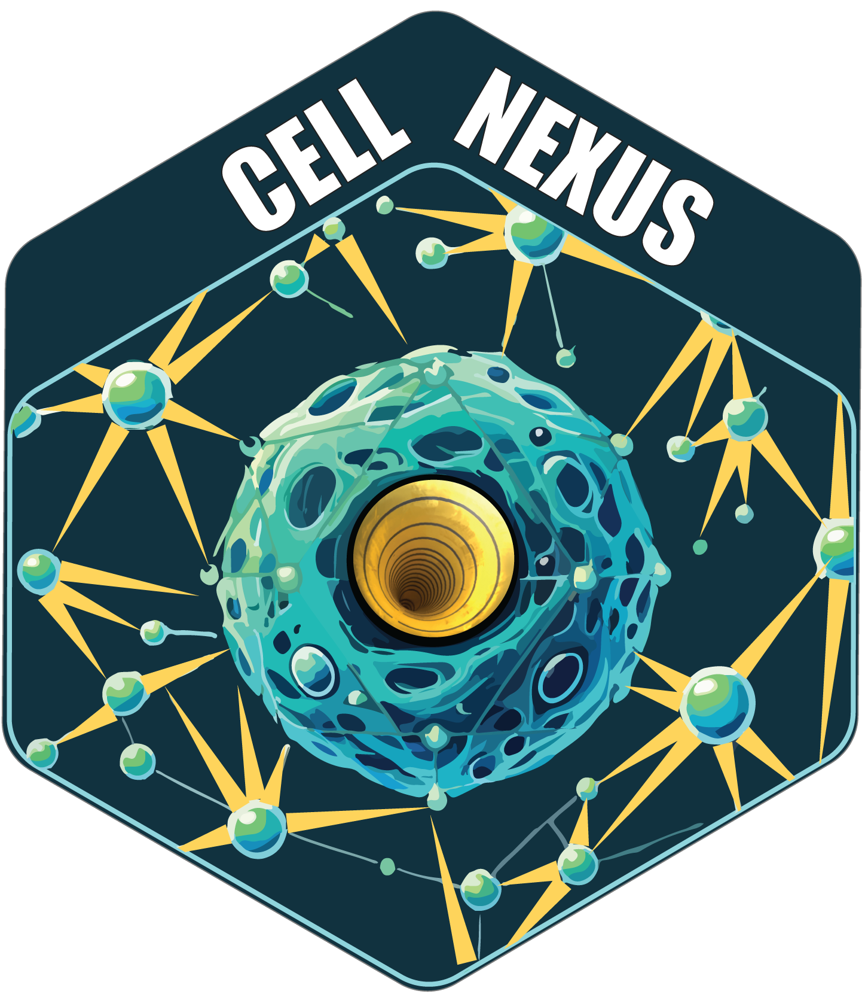
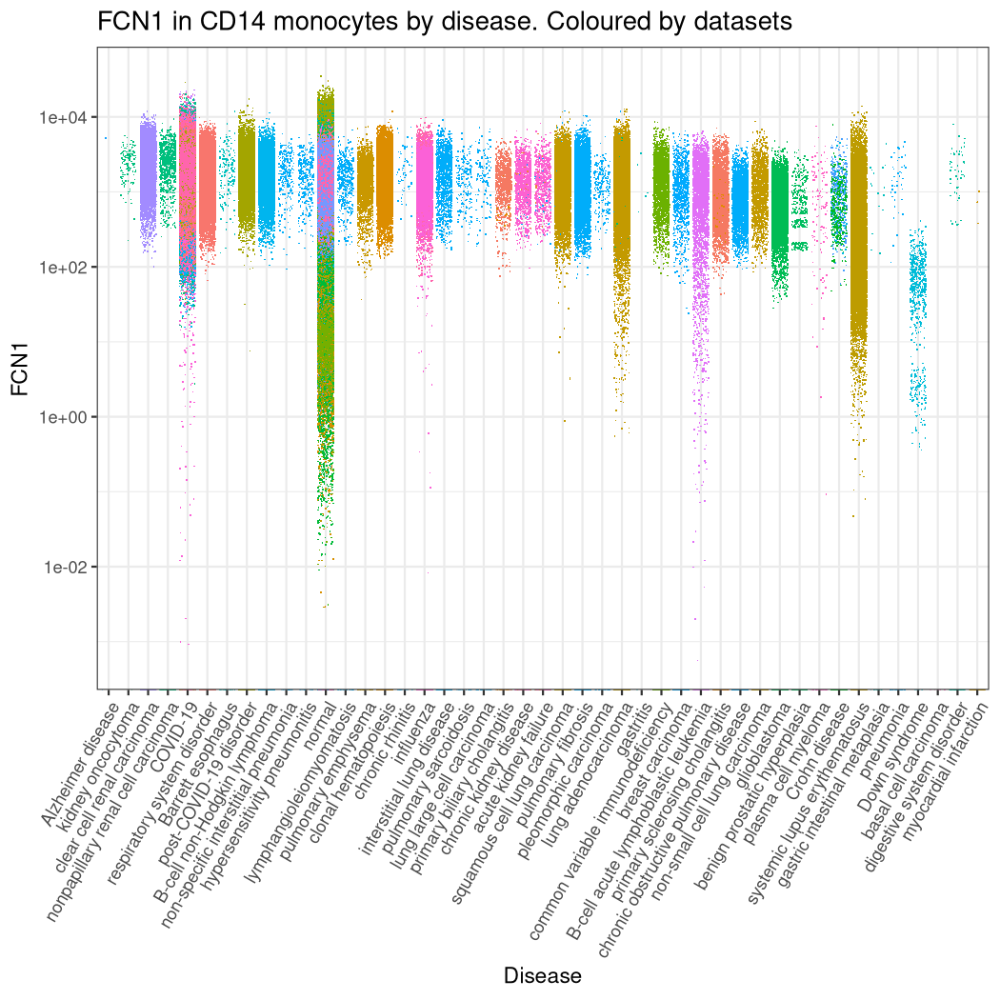
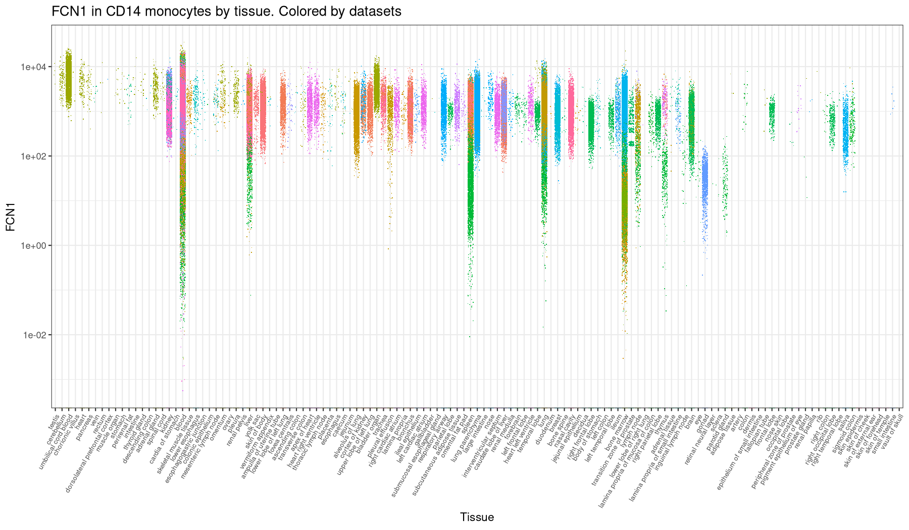

# cellNexus

[](https://lifecycle.r-lib.org/articles/stages.html#maturing)

## Introduction

`cellNexus` extends the functionality of `CuratedAtlasQueryR` by
providing a unified interface for querying and accessing the harmonised,
curated, and reannotated CELLxGENE human cell atlas. It enables
reproducible, programmatic exploration of large-scale single-cell
datasets, supporting data retrieval at the cell, sample, and dataset
levels with flexible filtering based on tissue, cell type, experimental
condition, and other metadata. Retrieved data are returned in formats
ready for downstream analysis.

The package integrates over 44 million human cells processed through a
standardised pipeline, including consistent quality control,
normalisation, and unified abundance representations (e.g., single-cell,
counts-per-million, normalised expression, and pseudobulk). This
harmonisation facilitates efficient cross-dataset comparison and
integration.

Data are hosted on the ARDC Nectar Research Cloud, and most functions
access them via web requests; therefore, an active network connection is
required for typical use.

While both cellNexus and CuratedAtlasQueryR rely on precomputed
expression layers, cellNexus adopts a more standardised and transparent
processing workflow. This includes explicit removal of empty droplets
and dead cells, followed by harmonised quality control, normalisation,
and multi-layer data generation, ensuring alignment with evolving
CELLxGENE releases.



plot of chunk fig-logo


plot of chunk fig-funders


plot of chunk fig-funders


plot of chunk fig-funders


plot of chunk fig-funders


plot of chunk fig-funders


plot of chunk fig-funders

## Query interface

### Installation

``` r

devtools::install_github("MangiolaLaboratory/cellNexus")
```

### Load the package

``` r

library(cellNexus)
```

### Load additional packages

``` r

suppressPackageStartupMessages({
  library(ggplot2)
})
```

### Load and explore the metadata

#### Load the metadata

By default,
[`get_metadata()`](https://mangiolalaboratory.github.io/cellNexus/reference/get_metadata.md)
loads harmonised annotations. Metadata is saved to
[`get_default_cache_dir()`](https://mangiolalaboratory.github.io/cellNexus/reference/get_default_cache_dir.md)
unless a custom path is provided via the cache_directory argument. The
`metadata` variable can then be re-used for all subsequent queries.

The unified pseudobulk AnnData object was pre-generated outside of this
vignette applying quality control and retaining at least 15,000
intersecting genes across samples and hosted on Zenodo to avoid lengthy
recompilation. Download the latest version:
[pseudobulk_se.h5ad](https://zenodo.org/records/21633607/files/pseudobulk_se.h5ad?download=1).
For all versions:
[10.5281/zenodo.21633607](https://zenodo.org/records/21633607).

The following sections demonstrate the metadata, quality control,
generation of raw and normalised counts, and pseudobulk construction for
the specified query.

``` r

metadata <- get_metadata()
metadata
#> # Source:   SQL [?? x 31]
#> # Database: DuckDB 1.4.3 [unknown@Linux 5.14.0-570.123.1.el9_6.x86_64:R 4.5.3/:memory:]
#>    cell_id observation_joinid dataset_id             sample_id donor_id age_days tissue_groups nFeature_expressed_i…¹ nCount_RNA
#>      <dbl> <chr>              <chr>                  <chr>     <chr>       <int> <chr>                          <int>      <dbl>
#>  1       1 `;+Wwc*oS9         574e9f9e-f8b4-41ef-bf… b290d7ef… BPH556      25915 prostate                        1025      113. 
#>  2       1 s<8rT5qe3X         574e9f9e-f8b4-41ef-bf… b290d7ef… BPH556      25915 prostate                        2586       77.6
#>  3       2 Se=|eIq*={         574e9f9e-f8b4-41ef-bf… b290d7ef… BPH556      25915 prostate                         992       57.6
#>  4       2 dcNO`ReB5o         574e9f9e-f8b4-41ef-bf… b290d7ef… BPH556      25915 prostate                        2002      163. 
#>  5       3 F_Jf~Pzj<!         574e9f9e-f8b4-41ef-bf… b290d7ef… BPH556      25915 prostate                         730       93.6
#>  6      16 i(U>N;cU4_         574e9f9e-f8b4-41ef-bf… b290d7ef… BPH556      25915 prostate                         718      342. 
#>  7       4 MK~^fbPVCl         574e9f9e-f8b4-41ef-bf… b290d7ef… BPH556      25915 prostate                         846       99.8
#>  8       4 J+o&MJmtR5         574e9f9e-f8b4-41ef-bf… b290d7ef… BPH556      25915 prostate                         829      123. 
#>  9      12 $LL!IWeW`F         574e9f9e-f8b4-41ef-bf… b290d7ef… BPH556      25915 prostate                        2482       61.8
#> 10      18 $zB;$PErEP         574e9f9e-f8b4-41ef-bf… b290d7ef… BPH556      25915 prostate                         828       86.6
#> # ℹ more rows
#> # ℹ abbreviated name: ¹​nFeature_expressed_in_sample
#> # ℹ 22 more variables: empty_droplet <lgl>, cell_type_unified_ensemble <chr>, is_immune <lgl>, subsets_Mito_percent <int>,
#> #   subsets_Ribo_percent <int>, high_mitochondrion <lgl>, high_ribosome <lgl>, alive <lgl>, scDblFinder.class <chr>,
#> #   file_id_cellNexus_single_cell <chr>, file_id_cellNexus_pseudobulk <chr>, count_upper_bound <dbl>,
#> #   nfeature_expressed_thresh <dbl>, inverse_transform <chr>, cell_annotation_blueprint_singler <chr>,
#> #   cell_annotation_monaco_singler <chr>, cell_annotation_azimuth_l2 <chr>, ethnicity_flagging_score <dbl>, …
```

### Quality control

cellNexus metadata applies standardised quality control to filter out
empty droplets, dead or damaged cells, doublets, and samples with low
gene counts.

``` r

metadata <- metadata |>
  keep_quality_cells()

nfeatures_df <- cellNexus:::get_cellxgene_metadata("dataset") |>
  dplyr::select(dplyr::where(~ !is.list(.x)))
  
metadata <- metadata |>
  dplyr::left_join(nfeatures_df,
                   by = "dataset_id",
                   copy = TRUE) |>
  dplyr::filter(feature_count >= 5000)
```

### Join Census metadata

Original Census annotations can be retrieved by the function
`get_census_metadata()`, and registered to lazy tibble format by
[DuckDB](https://duckdb.org/docs/current/clients/r)

``` r

census_metadata <- cellNexus:::get_census_metadata("2024-07-01")
#> ℹ Opening Census version 2024-07-01.
#> ℹ Reading Census obs table.

con <- dbplyr::remote_con(metadata)

duckdb::duckdb_register_arrow(con, "census_metadata", census_metadata)

metadata <- metadata |>
  dplyr::left_join(tbl(con, "census_metadata") |> 
                   dplyr::select(observation_joinid, dataset_id, tissue,
                                 self_reported_ethnicity, cell_type, assay,
                                 disease, sex))
#> Joining with `by = join_by(observation_joinid, dataset_id)`
```

#### Explore tissues

``` r

metadata |>
  dplyr::distinct(tissue, cell_type_unified_ensemble)
#> # Source:   SQL [?? x 2]
#> # Database: DuckDB 1.4.3 [unknown@Linux 5.14.0-570.123.1.el9_6.x86_64:R 4.5.3/:memory:]
#>    tissue                      cell_type_unified_ensemble
#>    <chr>                       <chr>                     
#>  1 transition zone of prostate cdc                       
#>  2 transition zone of prostate epithelial                
#>  3 transition zone of prostate b memory                  
#>  4 transition zone of prostate endothelial               
#>  5 transition zone of prostate monocytic                 
#>  6 transition zone of prostate dc                        
#>  7 transition zone of prostate nk                        
#>  8 transition zone of prostate other                     
#>  9 transition zone of prostate stromal                   
#> 10 transition zone of prostate b                         
#> # ℹ more rows
```

### Download single-cell RNA sequencing counts

#### Query raw counts

``` r
single_cell_counts <-
  metadata |>
  dplyr::filter(
    self_reported_ethnicity == "African American" &
      assay == "10x 3' v3" &
      tissue == "breast" &
      cell_type == "T cell"
  ) |>
  get_single_cell_experiment()
#> ℹ Realising metadata.
#> ℹ Synchronising files
#> ℹ Reading files.
#> 
Reading counts ■■■■■■■                           20% | ETA:  9s

Reading counts ■■■■■■■■■■                        30% | ETA:  7s

Reading counts ■■■■■■■■■■■■■                     40% | ETA:  5s

Reading counts ■■■■■■■■■■■■■■■■                  50% | ETA:  4s

Reading counts ■■■■■■■■■■■■■■■■■■■               60% | ETA:  3s

Reading counts ■■■■■■■■■■■■■■■■■■■■■■            70% | ETA:  2s

Reading counts ■■■■■■■■■■■■■■■■■■■■■■■■■         80% | ETA:  1s

Reading counts ■■■■■■■■■■■■■■■■■■■■■■■■■■■■      90% | ETA:  1s

                                                                
ℹ Compiling Experiment.

single_cell_counts
#> # A SingleCellExperiment-tibble abstraction: 2,806 × 54
#> # 
[90mFeatures=33145 | Cells=2806 | Assays=counts
[0m
#>    .cell observation_joinid dataset_id sample_id donor_id age_days tissue_groups nFeature_expressed_i…¹ nCount_RNA empty_droplet
#>    <chr> <chr>              <chr>      <chr>     <chr>       <int> <chr>                          <int>      <dbl> <lgl>        
#>  1 80_1  zz-!e5_XAo         842c6f5d-… 1de3f3ba… P58         14600 breast                          1749      10.8  FALSE        
#>  2 81_1  -mb&DWckf(         842c6f5d-… 1de3f3ba… P58         14600 breast                          1993      12.4  FALSE        
#>  3 73_1  z_=CTOs4{z         842c6f5d-… 4b5e66fa… P39         14600 breast                          2866      10.3  FALSE        
#>  4 74_1  fNzorxA`Mf         842c6f5d-… 4b5e66fa… P39         14600 breast                          1942       7.58 FALSE        
#>  5 1_1   I8a42<8st4         842c6f5d-… 184fa234… P65         14600 breast                          3395      11.8  FALSE        
#>  6 72_1  8wGs7JgUjj         842c6f5d-… 6b194412… P39         14600 breast                          2548      13.1  FALSE        
#>  7 75_1  F9G7A+GgjA         842c6f5d-… db5a69ed… P40         14600 breast                          1291      10.2  FALSE        
#>  8 76_1  bTlx!HK=oS         842c6f5d-… 52ab9222… P58         14600 breast                          1671       9.65 FALSE        
#>  9 77_1  E4g5+)v;AV         842c6f5d-… 52ab9222… P58         14600 breast                          2340      11.9  FALSE        
#> 10 78_1  +q?29B%2nH         842c6f5d-… 52ab9222… P58         14600 breast                          1714      13.2  FALSE        
#> # ℹ 2,796 more rows
#> # ℹ abbreviated name: ¹​nFeature_expressed_in_sample
#> # ℹ 44 more variables: cell_type_unified_ensemble <chr>, is_immune <lgl>, subsets_Mito_percent <int>,
#> #   subsets_Ribo_percent <int>, high_mitochondrion <lgl>, high_ribosome <lgl>, alive <lgl>, scDblFinder.class <chr>,
#> #   file_id_cellNexus_single_cell <chr>, file_id_cellNexus_pseudobulk <chr>, count_upper_bound <dbl>,
#> #   nfeature_expressed_thresh <dbl>, inverse_transform <chr>, cell_annotation_blueprint_singler <chr>,
#> #   cell_annotation_monaco_singler <chr>, cell_annotation_azimuth_l2 <chr>, ethnicity_flagging_score <dbl>, …
```

#### Query counts scaled per million

``` r
single_cell_cpm <-
  metadata |>
  dplyr::filter(
    self_reported_ethnicity == "African American" &
      assay == "10x 3' v3" &
      tissue == "breast" &
      cell_type == "T cell"
  ) |>
  get_single_cell_experiment(assays = "cpm")
#> ℹ Realising metadata.
#> ℹ Synchronising files
#> ℹ Reading files.
#> 
Reading cpm ■■■■■■■                           20% | ETA:  6s

Reading cpm ■■■■■■■■■■                        30% | ETA:  4s

Reading cpm ■■■■■■■■■■■■■                     40% | ETA:  4s

Reading cpm ■■■■■■■■■■■■■■■■                  50% | ETA:  3s

Reading cpm ■■■■■■■■■■■■■■■■■■■               60% | ETA:  3s

Reading cpm ■■■■■■■■■■■■■■■■■■■■■■            70% | ETA:  2s

Reading cpm ■■■■■■■■■■■■■■■■■■■■■■■■■         80% | ETA:  1s

Reading cpm ■■■■■■■■■■■■■■■■■■■■■■■■■■■■      90% | ETA:  1s

                                                             
ℹ Compiling Experiment.

single_cell_cpm
#> # A SingleCellExperiment-tibble abstraction: 2,806 × 54
#> # 
[90mFeatures=33145 | Cells=2806 | Assays=cpm
[0m
#>    .cell observation_joinid dataset_id sample_id donor_id age_days tissue_groups nFeature_expressed_i…¹ nCount_RNA empty_droplet
#>    <chr> <chr>              <chr>      <chr>     <chr>       <int> <chr>                          <int>      <dbl> <lgl>        
#>  1 76_1  bTlx!HK=oS         842c6f5d-… 52ab9222… P58         14600 breast                          1671       9.65 FALSE        
#>  2 77_1  E4g5+)v;AV         842c6f5d-… 52ab9222… P58         14600 breast                          2340      11.9  FALSE        
#>  3 78_1  +q?29B%2nH         842c6f5d-… 52ab9222… P58         14600 breast                          1714      13.2  FALSE        
#>  4 79_1  zuJ#MBMWy;         842c6f5d-… 52ab9222… P58         14600 breast                          1506      12.3  FALSE        
#>  5 1_1   I8a42<8st4         842c6f5d-… 184fa234… P65         14600 breast                          3395      11.8  FALSE        
#>  6 72_1  8wGs7JgUjj         842c6f5d-… 6b194412… P39         14600 breast                          2548      13.1  FALSE        
#>  7 75_1  F9G7A+GgjA         842c6f5d-… db5a69ed… P40         14600 breast                          1291      10.2  FALSE        
#>  8 80_1  zz-!e5_XAo         842c6f5d-… 1de3f3ba… P58         14600 breast                          1749      10.8  FALSE        
#>  9 81_1  -mb&DWckf(         842c6f5d-… 1de3f3ba… P58         14600 breast                          1993      12.4  FALSE        
#> 10 73_1  z_=CTOs4{z         842c6f5d-… 4b5e66fa… P39         14600 breast                          2866      10.3  FALSE        
#> # ℹ 2,796 more rows
#> # ℹ abbreviated name: ¹​nFeature_expressed_in_sample
#> # ℹ 44 more variables: cell_type_unified_ensemble <chr>, is_immune <lgl>, subsets_Mito_percent <int>,
#> #   subsets_Ribo_percent <int>, high_mitochondrion <lgl>, high_ribosome <lgl>, alive <lgl>, scDblFinder.class <chr>,
#> #   file_id_cellNexus_single_cell <chr>, file_id_cellNexus_pseudobulk <chr>, count_upper_bound <dbl>,
#> #   nfeature_expressed_thresh <dbl>, inverse_transform <chr>, cell_annotation_blueprint_singler <chr>,
#> #   cell_annotation_monaco_singler <chr>, cell_annotation_azimuth_l2 <chr>, ethnicity_flagging_score <dbl>, …
```

#### Query SCT normalised counts

``` r
single_cell_sct <-
  metadata |>
  dplyr::filter(
    self_reported_ethnicity == "African American" &
      assay == "10x 3' v3" &
      tissue == "breast" &
      cell_type == "T cell"
  ) |>
  get_single_cell_experiment(assays = "sct")
#> ℹ Realising metadata.
#> ℹ Synchronising files
#> ℹ Reading files.
#> ! The number of cells in the SingleCellExperiment will be less than the number of cells you have selected from the metadata. Are cell IDs duplicated? Or, do cell IDs correspond to the counts file?
#> 
Reading sct ■■■■■■■                           20% | ETA:  5s

Reading sct ■■■■■■■■■■                        30% | ETA:  4s

Reading sct ■■■■■■■■■■■■■                     40% | ETA:  4s

                                                             
! The number of cells in the SingleCellExperiment will be less than the number of cells you have selected from the metadata. Are cell IDs duplicated? Or, do cell IDs correspond to the counts file?
#> Reading sct ■■■■■■■■■■■■■                     40% | ETA:  4s

Reading sct ■■■■■■■■■■■■■■■■                  50% | ETA:  3s

                                                             
! The number of cells in the SingleCellExperiment will be less than the number of cells you have selected from the metadata. Are cell IDs duplicated? Or, do cell IDs correspond to the counts file?
#> Reading sct ■■■■■■■■■■■■■■■■                  50% | ETA:  3s

Reading sct ■■■■■■■■■■■■■■■■■■■               60% | ETA:  2s

Reading sct ■■■■■■■■■■■■■■■■■■■■■■            70% | ETA:  2s

                                                             
! The number of cells in the SingleCellExperiment will be less than the number of cells you have selected from the metadata. Are cell IDs duplicated? Or, do cell IDs correspond to the counts file?
#> Reading sct ■■■■■■■■■■■■■■■■■■■■■■            70% | ETA:  2s

Reading sct ■■■■■■■■■■■■■■■■■■■■■■■■■         80% | ETA:  1s

Reading sct ■■■■■■■■■■■■■■■■■■■■■■■■■■■■      90% | ETA:  1s

                                                             
! cellNexus says: 1613 cell(s) from your metadata are absent from the SCT assay across 4 file(s). This is expected: SCT normalisation is run per sample and may fail for samples with very few cells or extreme count distributions. The returned object contains only cells from samples where SCT succeeded. Affected sample_id(s): 52ab92226337d36c306466eefe67f9c1, 765554078ca8d1eaf2712000c0df0d6f, 8940e0767e7eca1b72d37b4138be2276, a79912cb9aaa8d8c0b1a3cdcc9294f8c, 5e641a2218d1d8b91f638989626c89e0.
#> ℹ Compiling Experiment.

single_cell_sct
#> # A SingleCellExperiment-tibble abstraction: 1,193 × 54
#> # 
[90mFeatures=33145 | Cells=1193 | Assays=sct
[0m
#>    .cell observation_joinid dataset_id sample_id donor_id age_days tissue_groups nFeature_expressed_i…¹ nCount_RNA empty_droplet
#>    <chr> <chr>              <chr>      <chr>     <chr>       <int> <chr>                          <int>      <dbl> <lgl>        
#>  1 80_1  zz-!e5_XAo         842c6f5d-… 1de3f3ba… P58         14600 breast                          1749      10.8  FALSE        
#>  2 81_1  -mb&DWckf(         842c6f5d-… 1de3f3ba… P58         14600 breast                          1993      12.4  FALSE        
#>  3 72_1  8wGs7JgUjj         842c6f5d-… 6b194412… P39         14600 breast                          2548      13.1  FALSE        
#>  4 75_1  F9G7A+GgjA         842c6f5d-… db5a69ed… P40         14600 breast                          1291      10.2  FALSE        
#>  5 73_1  z_=CTOs4{z         842c6f5d-… 4b5e66fa… P39         14600 breast                          2866      10.3  FALSE        
#>  6 74_1  fNzorxA`Mf         842c6f5d-… 4b5e66fa… P39         14600 breast                          1942       7.58 FALSE        
#>  7 1_1   I8a42<8st4         842c6f5d-… 184fa234… P65         14600 breast                          3395      11.8  FALSE        
#>  8 1_2   >8f0}-gXFY         842c6f5d-… 81d05f17… P63         14600 breast                          2513      13.3  FALSE        
#>  9 22_2  2lQ`<&l3-A         842c6f5d-… 30967738… P57         14600 breast                          2058       9.91 FALSE        
#> 10 23_2  sqV-|vcI4R         842c6f5d-… d8ecdd92… P41         14600 breast                          2375      13.7  FALSE        
#> # ℹ 1,183 more rows
#> # ℹ abbreviated name: ¹​nFeature_expressed_in_sample
#> # ℹ 44 more variables: cell_type_unified_ensemble <chr>, is_immune <lgl>, subsets_Mito_percent <int>,
#> #   subsets_Ribo_percent <int>, high_mitochondrion <lgl>, high_ribosome <lgl>, alive <lgl>, scDblFinder.class <chr>,
#> #   file_id_cellNexus_single_cell <chr>, file_id_cellNexus_pseudobulk <chr>, count_upper_bound <dbl>,
#> #   nfeature_expressed_thresh <dbl>, inverse_transform <chr>, cell_annotation_blueprint_singler <chr>,
#> #   cell_annotation_monaco_singler <chr>, cell_annotation_azimuth_l2 <chr>, ethnicity_flagging_score <dbl>, …
```

#### Query pseudobulk

``` r
pseudobulk_counts <-
  metadata |>
  dplyr::filter(
    assay == "10x 5' v1" &
      tissue == "lung" &
      cell_type == "classical monocyte"
  ) |>
  get_pseudobulk()
#> ℹ Realising metadata.
#> ℹ Synchronising files
#> ℹ Reading files.
#> 
Reading counts ■■■■■                             14% | ETA:  9s

Reading counts ■■■■■■■■■■                        29% | ETA:  9s

Reading counts ■■■■■■■■■■■■■■                    43% | ETA:  7s

Reading counts ■■■■■■■■■■■■■■■■■■                57% | ETA:  5s

Reading counts ■■■■■■■■■■■■■■■■■■■■■■            71% | ETA:  4s

Reading counts ■■■■■■■■■■■■■■■■■■■■■■■■■■■       86% | ETA:  2s

                                                                
! cellNexus says: Not all genes completely overlap across the provided objects. Counts are generated by genes intersection.
#> ℹ Compiling Experiment.

pseudobulk_counts
#> # A SingleCellExperiment-tibble abstraction: 146 × 46
#> # 
[90mFeatures=15888 | Cells=146 | Assays=counts
[0m
#>    .cell  sample_id cell_type_unified_en…¹ dataset_id donor_id age_days tissue_groups empty_droplet is_immune high_mitochondrion
#>    <chr>  <chr>     <chr>                  <chr>      <chr>       <int> <chr>         <lgl>         <lgl>     <lgl>             
#>  1 2e8c9… 2e8c9911… cd14 mono              0ba16f4b-… HDBR152…       NA respiratory … FALSE         TRUE      FALSE             
#>  2 f71af… f71af64a… monocytic              1e6a6ef9-… Leader_…    27010 respiratory … FALSE         TRUE      FALSE             
#>  3 f71af… f71af64a… cd14 mono              1e6a6ef9-… Leader_…    27010 respiratory … FALSE         TRUE      FALSE             
#>  4 f71af… f71af64a… cd8 tem                1e6a6ef9-… Leader_…    27010 respiratory … FALSE         TRUE      FALSE             
#>  5 11721… 11721339… monocytic              1e6a6ef9-… Leader_…    26645 respiratory … FALSE         TRUE      FALSE             
#>  6 11721… 11721339… cd14 mono              1e6a6ef9-… Leader_…    26645 respiratory … FALSE         TRUE      FALSE             
#>  7 0d874… 0d874636… cd14 mono              1e6a6ef9-… Leader_…    29930 respiratory … FALSE         TRUE      FALSE             
#>  8 0d874… 0d874636… cd16 mono              1e6a6ef9-… Leader_…    29930 respiratory … FALSE         TRUE      FALSE             
#>  9 0d874… 0d874636… macrophage             1e6a6ef9-… Leader_…    29930 respiratory … FALSE         TRUE      FALSE             
#> 10 0d874… 0d874636… monocytic              1e6a6ef9-… Leader_…    29930 respiratory … FALSE         TRUE      FALSE             
#> # ℹ 136 more rows
#> # ℹ abbreviated name: ¹​cell_type_unified_ensemble
#> # ℹ 36 more variables: alive <lgl>, scDblFinder.class <chr>, file_id_cellNexus_single_cell <chr>,
#> #   file_id_cellNexus_pseudobulk <chr>, count_upper_bound <dbl>, nfeature_expressed_thresh <dbl>, inverse_transform <chr>,
#> #   cell_annotation_azimuth_l2 <chr>, ethnicity_flagging_score <dbl>, low_confidence_ethnicity <chr>, .aggregated_cells <int>,
#> #   imputed_ethnicity <chr>, atlas_id <chr>, dataset_version_id <chr>, collection_id <chr>, cell_count <int>, citation <chr>,
#> #   default_embedding <chr>, explorer_url <chr>, feature_count <int>, mean_genes_per_cell <dbl>, primary_cell_count <int>, …
```

### Download cell communication metadata

Cell communication metadata was generated based on post-QC cells per
sample using `CellChat v2` method. It uses our harmonised cell type
annotation (cell_type_unified_ensemble) to infer the communication. It
captures inferred communication at both the ligand–receptor pair level
and the signalling pathway level.

- interaction_count: The number of inferred interactions between each
  pair of cell groups.

- interaction_weight: The aggregated communication strength between each
  pair of cell groups.

For definitions of additional annotations, please refer to the CellChat
v2 documentation: <https://github.com/jinworks/CellChat>.

For demonstration purpose, read cell communication metadata from a demo
file here. Users do not need to specify cloud_metadata argument in this
case.

``` r

get_cell_communication_strength(cloud_metadata = get_metadata_url("cellNexus_lr_signaling_pathway_strength_DEMO.parquet"))
#> # Source:   SQL [?? x 16]
#> # Database: DuckDB 1.4.3 [unknown@Linux 5.14.0-570.123.1.el9_6.x86_64:R 4.5.3/:memory:]
#>   source    target ligand receptor   lr_prob lr_pval interaction_name    interaction_name_2     pathway_name annotation evidence
#>   <chr>     <chr>  <chr>  <chr>        <dbl>   <dbl> <chr>               <chr>                  <chr>        <chr>      <chr>   
#> 1 b         b      TGFB1  TGFbR1_R2 0.000116    1    TGFB1_TGFBR1_TGFBR2 TGFB1 - (TGFBR1+TGFBR… TGFb         Secreted … KEGG: h…
#> 2 b memory  b      TGFB1  TGFbR1_R2 0.000865    1    TGFB1_TGFBR1_TGFBR2 TGFB1 - (TGFBR1+TGFBR… TGFb         Secreted … KEGG: h…
#> 3 b naive   b      TGFB1  TGFbR1_R2 0.000696    0.99 TGFB1_TGFBR1_TGFBR2 TGFB1 - (TGFBR1+TGFBR… TGFb         Secreted … KEGG: h…
#> 4 cd14 mono b      TGFB1  TGFbR1_R2 0.00240     0.81 TGFB1_TGFBR1_TGFBR2 TGFB1 - (TGFBR1+TGFBR… TGFb         Secreted … KEGG: h…
#> 5 cd4 naive b      TGFB1  TGFbR1_R2 0.000957    1    TGFB1_TGFBR1_TGFBR2 TGFB1 - (TGFBR1+TGFBR… TGFb         Secreted … KEGG: h…
#> 6 cd4 tem   b      TGFB1  TGFbR1_R2 0.00242     0.76 TGFB1_TGFBR1_TGFBR2 TGFB1 - (TGFBR1+TGFBR… TGFb         Secreted … KEGG: h…
#> # ℹ 5 more variables: pathway_prob <dbl>, pathway_pval <dbl>, sample_id <chr>, interaction_count <dbl>,
#> #   interaction_weight <dbl>
```

#### Extract only a subset of genes

This is helpful if just few genes are of interest (e.g ENSG00000134644
(PUM1)), as they can be compared across samples. cellNexus uses ENSEMBL
gene ID(s).

``` r
single_cell_cpm <-
  metadata |>
  dplyr::filter(
    self_reported_ethnicity == "African American" &
      assay == "10x 3' v3" &
      tissue == "breast" &
      cell_type == "T cell"
  ) |>
  get_single_cell_experiment(assays = "cpm", features = "ENSG00000134644")
#> ℹ Realising metadata.
#> ℹ Synchronising files
#> ℹ Reading files.
#> 
Reading cpm ■■■■■■■                           20% | ETA:  4s

Reading cpm ■■■■■■■■■■                        30% | ETA:  4s

Reading cpm ■■■■■■■■■■■■■                     40% | ETA:  3s

Reading cpm ■■■■■■■■■■■■■■■■                  50% | ETA:  3s

Reading cpm ■■■■■■■■■■■■■■■■■■■               60% | ETA:  2s

Reading cpm ■■■■■■■■■■■■■■■■■■■■■■            70% | ETA:  2s

Reading cpm ■■■■■■■■■■■■■■■■■■■■■■■■■         80% | ETA:  1s

Reading cpm ■■■■■■■■■■■■■■■■■■■■■■■■■■■■      90% | ETA:  1s

                                                             
ℹ Compiling Experiment.

single_cell_cpm
#> # A SingleCellExperiment-tibble abstraction: 2,806 × 54
#> # 
[90mFeatures=1 | Cells=2806 | Assays=cpm
[0m
#>    .cell observation_joinid dataset_id sample_id donor_id age_days tissue_groups nFeature_expressed_i…¹ nCount_RNA empty_droplet
#>    <chr> <chr>              <chr>      <chr>     <chr>       <int> <chr>                          <int>      <dbl> <lgl>        
#>  1 76_1  bTlx!HK=oS         842c6f5d-… 52ab9222… P58         14600 breast                          1671       9.65 FALSE        
#>  2 77_1  E4g5+)v;AV         842c6f5d-… 52ab9222… P58         14600 breast                          2340      11.9  FALSE        
#>  3 78_1  +q?29B%2nH         842c6f5d-… 52ab9222… P58         14600 breast                          1714      13.2  FALSE        
#>  4 79_1  zuJ#MBMWy;         842c6f5d-… 52ab9222… P58         14600 breast                          1506      12.3  FALSE        
#>  5 72_1  8wGs7JgUjj         842c6f5d-… 6b194412… P39         14600 breast                          2548      13.1  FALSE        
#>  6 75_1  F9G7A+GgjA         842c6f5d-… db5a69ed… P40         14600 breast                          1291      10.2  FALSE        
#>  7 80_1  zz-!e5_XAo         842c6f5d-… 1de3f3ba… P58         14600 breast                          1749      10.8  FALSE        
#>  8 81_1  -mb&DWckf(         842c6f5d-… 1de3f3ba… P58         14600 breast                          1993      12.4  FALSE        
#>  9 73_1  z_=CTOs4{z         842c6f5d-… 4b5e66fa… P39         14600 breast                          2866      10.3  FALSE        
#> 10 74_1  fNzorxA`Mf         842c6f5d-… 4b5e66fa… P39         14600 breast                          1942       7.58 FALSE        
#> # ℹ 2,796 more rows
#> # ℹ abbreviated name: ¹​nFeature_expressed_in_sample
#> # ℹ 44 more variables: cell_type_unified_ensemble <chr>, is_immune <lgl>, subsets_Mito_percent <int>,
#> #   subsets_Ribo_percent <int>, high_mitochondrion <lgl>, high_ribosome <lgl>, alive <lgl>, scDblFinder.class <chr>,
#> #   file_id_cellNexus_single_cell <chr>, file_id_cellNexus_pseudobulk <chr>, count_upper_bound <dbl>,
#> #   nfeature_expressed_thresh <dbl>, inverse_transform <chr>, cell_annotation_blueprint_singler <chr>,
#> #   cell_annotation_monaco_singler <chr>, cell_annotation_azimuth_l2 <chr>, ethnicity_flagging_score <dbl>, …
```

#### Extract the counts as a Seurat object

This convert the H5 SingleCellExperiment to Seurat so it might take long
time and occupy a lot of memory depending on how many cells you are
requesting.

``` r
seurat_counts <-
  metadata |>
  dplyr::filter(
    self_reported_ethnicity == "African American" &
      assay == "10x 3' v3" &
      tissue == "breast" &
      cell_type == "T cell"
  ) |>
  get_seurat()
#> ℹ Realising metadata.
#> ℹ Synchronising files
#> ℹ Reading files.
#> 
Reading counts ■■■■■■■                           20% | ETA:  4s

Reading counts ■■■■■■■■■■                        30% | ETA:  4s

Reading counts ■■■■■■■■■■■■■                     40% | ETA:  3s

Reading counts ■■■■■■■■■■■■■■■■                  50% | ETA:  3s

Reading counts ■■■■■■■■■■■■■■■■■■■               60% | ETA:  2s

Reading counts ■■■■■■■■■■■■■■■■■■■■■■            70% | ETA:  2s

Reading counts ■■■■■■■■■■■■■■■■■■■■■■■■■         80% | ETA:  1s

Reading counts ■■■■■■■■■■■■■■■■■■■■■■■■■■■■      90% | ETA:  1s

                                                                
ℹ Compiling Experiment.

seurat_counts
#> # A Seurat-tibble abstraction: 2,806 × 59
#> # 
[90mFeatures=33145 | Cells=2806 | Active assay=counts | Assays=counts
[0m
#>    .cell orig.ident    nCount_originalexp nFeature_originalexp observation_joinid dataset_id         sample_id donor_id age_days
#>    <chr> <fct>                      <dbl>                <int> <chr>              <chr>              <chr>     <chr>       <int>
#>  1 73_1  SeuratProject               14.1                 2958 z_=CTOs4{z         842c6f5d-4a94-4ee… 4b5e66fa… P39         14600
#>  2 74_1  SeuratProject               14.2                 2035 fNzorxA`Mf         842c6f5d-4a94-4ee… 4b5e66fa… P39         14600
#>  3 76_1  SeuratProject               15.5                 1759 bTlx!HK=oS         842c6f5d-4a94-4ee… 52ab9222… P58         14600
#>  4 77_1  SeuratProject               15.4                 2434 E4g5+)v;AV         842c6f5d-4a94-4ee… 52ab9222… P58         14600
#>  5 78_1  SeuratProject               15.3                 1798 +q?29B%2nH         842c6f5d-4a94-4ee… 52ab9222… P58         14600
#>  6 79_1  SeuratProject               15.4                 1595 zuJ#MBMWy;         842c6f5d-4a94-4ee… 52ab9222… P58         14600
#>  7 1_1   SeuratProject               15.3                 3493 I8a42<8st4         842c6f5d-4a94-4ee… 184fa234… P65         14600
#>  8 80_1  SeuratProject               15.5                 1837 zz-!e5_XAo         842c6f5d-4a94-4ee… 1de3f3ba… P58         14600
#>  9 81_1  SeuratProject               15.2                 2082 -mb&DWckf(         842c6f5d-4a94-4ee… 1de3f3ba… P58         14600
#> 10 72_1  SeuratProject               18.0                 2642 8wGs7JgUjj         842c6f5d-4a94-4ee… 6b194412… P39         14600
#> # ℹ 2,796 more rows
#> # ℹ 50 more variables: tissue_groups <chr>, nFeature_expressed_in_sample <int>, nCount_RNA <dbl>, empty_droplet <lgl>,
#> #   cell_type_unified_ensemble <chr>, is_immune <lgl>, subsets_Mito_percent <int>, subsets_Ribo_percent <int>,
#> #   high_mitochondrion <lgl>, high_ribosome <lgl>, alive <lgl>, scDblFinder.class <chr>, file_id_cellNexus_single_cell <chr>,
#> #   file_id_cellNexus_pseudobulk <chr>, count_upper_bound <dbl>, nfeature_expressed_thresh <dbl>, inverse_transform <chr>,
#> #   cell_annotation_blueprint_singler <chr>, cell_annotation_monaco_singler <chr>, cell_annotation_azimuth_l2 <chr>,
#> #   ethnicity_flagging_score <dbl>, low_confidence_ethnicity <chr>, .aggregated_cells <int>, imputed_ethnicity <chr>, …
```

By default, data is downloaded to
[`get_default_cache_dir()`](https://mangiolalaboratory.github.io/cellNexus/reference/get_default_cache_dir.md)
output. If memory is a concern, users can specify a custom path to
metadata and counts `cache_directory` argument. For example,
`get_metadata(cache_directory = "your_own_path")` and
`get_single_cell_experiment(cache_directory = "your_own_path")`.

Same strategy can be applied for functions `get_pseuodbulk()` and
[`get_seurat()`](https://mangiolalaboratory.github.io/cellNexus/reference/get_seurat.md).

### Save your `SingleCellExperiment`

The returned `SingleCellExperiment` can be saved with three modalities,
as `.rds` or as `HDF5` or as `H5AD`.

#### Saving as RDS (fast saving, slow reading)

Saving as `.rds` has the advantage of being fast, and the `.rds` file
occupies very little disk space as it only stores the links to the files
in your cache.

However it has the disadvantage that for big `SingleCellExperiment`
objects, which merge a lot of HDF5 from your
`get_single_cell_experiment`, the display and manipulation is going to
be slow. In addition, an `.rds` saved in this way is not portable: you
will not be able to share it with other users.

``` r

single_cell_counts |>
  saveRDS("single_cell_counts.rds")
```

#### Saving as HDF5 (slow saving, fast reading)

Saving as `.hdf5` executes any computation on the `SingleCellExperiment`
and writes it to disk as a monolithic `HDF5`. Once this is done,
operations on the `SingleCellExperiment` will be comparatively very
fast. The resulting `.hdf5` file will also be totally portable and
sharable.

However this `.hdf5` has the disadvantage of being larger than the
corresponding `.rds` as it includes a copy of the count information, and
the saving process is going to be slow for large objects.

``` r

# ! IMPORTANT if you save 200K+ cells
HDF5Array::setAutoBlockSize(size = 1e+09)

single_cell_counts |>
  HDF5Array::saveHDF5SummarizedExperiment(
    "single_cell_counts",
    replace = TRUE,
    as.sparse = TRUE,
    verbose = TRUE
  )
```

#### Saving as H5AD (slow saving, fast reading)

Saving as `.h5ad` executes any computation on the `SingleCellExperiment`
and writes it to disk as a monolithic `H5AD`. The `H5AD` format is the
HDF5 disk representation of the AnnData object and is well-supported in
Python.

However this `.h5ad` saving strategy has a bottleneck of handling
columns with only NA values of a `SingleCellExperiment` metadata.

``` r

single_cell_counts |>
  anndataR::write_h5ad("single_cell_counts.h5ad",
    compression = "gzip",
    verbose = TRUE
  )
```

### Visualise gene transcription

We can gather all CD14 monocytes cells and plot the distribution of
ENSG00000085265 (FCN1) across all tissues

``` r

# Plots with styling
counts <- metadata |>

  # Filter and subset
  dplyr::filter(cell_type_unified_ensemble == "cd14 mono") |>

  # Get counts per million for FCN1 gene
  get_single_cell_experiment(assays = "cpm", features = "ENSG00000085265") |>
  suppressMessages() |>

  # Add feature to table
  tidySingleCellExperiment::join_features("ENSG00000085265", shape = "wide") |>

  # Rank x axis
  tibble::as_tibble() |>

  # Rename to gene symbol
  dplyr::rename(FCN1 = ENSG00000085265)

# Plot by disease
counts |>
  dplyr::with_groups(disease, ~ .x |>
    dplyr::mutate(median_count = median(`FCN1`, rm.na = TRUE))) |>

  # Plot
  ggplot(aes(forcats::fct_reorder(disease, median_count, .desc = TRUE), `FCN1`, color = dataset_id)) +
  geom_jitter(shape = ".") +

  # Style
  guides(color = "none") +
  scale_y_log10() +
  theme_bw() +
  theme(axis.text.x = element_text(angle = 60, vjust = 1, hjust = 1)) +
  xlab("Disease") +
  ggtitle("FCN1 in CD14 monocytes by disease. Coloured by datasets")
#> Warning in scale_y_log10(): log-10 transformation introduced infinite values.
```



plot of chunk plot-fcn1-disease

``` r

# Plot by tissue
counts |>
  dplyr::with_groups(tissue, ~ .x |>
    dplyr::mutate(median_count = median(`FCN1`, rm.na = TRUE))) |>

  # Plot
  ggplot(aes(
    forcats::fct_reorder(tissue,
      median_count,
      .desc = TRUE
    ),
    `FCN1`,
    color = dataset_id
  )) +
  geom_jitter(shape = ".") +

  # Style
  guides(color = "none") +
  scale_y_log10() +
  theme_bw() +
  theme(axis.text.x = element_text(angle = 60, vjust = 1, hjust = 1)) +
  xlab("Tissue") +
  ggtitle("FCN1 in CD14 monocytes by tissue. Colored by datasets") +
  theme(legend.position = "none", axis.text.x = element_text(size = 6.5))
#> Warning in scale_y_log10(): log-10 transformation introduced infinite values.
```



plot of chunk plot-fcn1-tissue

### Integrate cloud and local metadata

`cellNexus` not only enables users to query our metadata but also allows
integration with your local metadata. Additionally, users can integrate
with your metadata stored in the cloud.

To enable this feature, users must include
`file_id_cellNexus_single_cell` and `atlas_id` (e.g cellxgene/dd-mm-yy)
columns in the metadata. See metadata structure in cellNexus::pbmc3k_sce

``` r

# Set up local cache and paths
local_cache <- tempdir()
layer <- "counts"
meta_path <- file.path(local_cache, "pbmc3k_metadata.parquet")
data(pbmc3k_sce)

# Extract and prepare metadata
pbmc3k_metadata <- pbmc3k_sce |>
  S4Vectors::metadata() |>
  purrr::pluck("data") |>
  dplyr::mutate(
    counts_directory = file.path(tempdir(), atlas_id, layer),
    sce_path = file.path(counts_directory, file_id_cellNexus_single_cell)
  )

# Get unique paths
counts_directory <- pbmc3k_metadata |>
  dplyr::pull(counts_directory) |>
  unique()

sce_path <- pbmc3k_metadata |>
  dplyr::pull(sce_path) |>
  unique()

# Create directory structure
dir.create(counts_directory, recursive = TRUE, showWarnings = FALSE)

# Save data to disk
pbmc3k_sce |>
  S4Vectors::metadata() |>
  purrr::pluck("data") |>
  arrow::write_parquet(meta_path)

# Save SCE object
pbmc3k_sce |>
  anndataR::write_h5ad(sce_path, compression = "gzip", mode = "w")
```

``` r

# A cellNexus file
file_id_from_cloud <- "e52795dec7b626b6276b867d55328d9f___1.h5ad"
file_id_local <- basename(sce_path)

get_metadata(
  cloud_metadata = cellNexus::SAMPLE_DATABASE_URL,
  local_metadata = meta_path,
  cache_directory = local_cache
) |>
  # For illustration purpose, only filter a selected cloud metadata and the saved metadata
  dplyr::filter(file_id_cellNexus_single_cell %in% c(file_id_from_cloud, file_id_local)) |>
  dplyr::select(cell_id, sample_id, dataset_id, cell_type_unified_ensemble, atlas_id, file_id_cellNexus_single_cell) |>
  get_single_cell_experiment(cache_directory = local_cache)
#> ℹ Downloading 1 file, totalling 0 GB
#> ℹ Downloading https://object-store.rc.nectar.org.au/v1/AUTH_06d6e008e3e642da99d806ba3ea629c5/cellNexus-metadata/sample_hca2024_v2.3.2.parquet to /vast/scratch/users/shen.m/tmp/RtmpE4YcCe/sample_hca2024_v2.3.2.parquet
#> ℹ Realising metadata.
#> ℹ Synchronising files
#> ℹ Reading files.
#> ℹ Compiling Experiment.
#> # A SingleCellExperiment-tibble abstraction: 500 × 7
#> # Features=13132 | Cells=500 | Assays=counts
#>    .cell            sample_id dataset_id cell_type_unified_ensemble atlas_id             file_id_cellNexus_sing…¹ original_cell_
#>    <chr>            <chr>     <chr>      <chr>                      <chr>                <chr>                    <chr>         
#>  1 AAACATACAACCAC_1 pbmc3k    pbmc3k     Memory CD4 T               cellxgene/03-10-2025 67e196a3c4e145151fc9e06… AAACATACAACCAC
#>  2 AAACATTGAGCTAC_1 pbmc3k    pbmc3k     B                          cellxgene/03-10-2025 67e196a3c4e145151fc9e06… AAACATTGAGCTAC
#>  3 AAACATTGATCAGC_1 pbmc3k    pbmc3k     Memory CD4 T               cellxgene/03-10-2025 67e196a3c4e145151fc9e06… AAACATTGATCAGC
#>  4 AAACCGTGCTTCCG_1 pbmc3k    pbmc3k     CD14+ Mono                 cellxgene/03-10-2025 67e196a3c4e145151fc9e06… AAACCGTGCTTCCG
#>  5 AAACCGTGTATGCG_1 pbmc3k    pbmc3k     NK                         cellxgene/03-10-2025 67e196a3c4e145151fc9e06… AAACCGTGTATGCG
#>  6 AAACGCACTGGTAC_1 pbmc3k    pbmc3k     Memory CD4 T               cellxgene/03-10-2025 67e196a3c4e145151fc9e06… AAACGCACTGGTAC
#>  7 AAACGCTGACCAGT_1 pbmc3k    pbmc3k     CD8 T                      cellxgene/03-10-2025 67e196a3c4e145151fc9e06… AAACGCTGACCAGT
#>  8 AAACGCTGGTTCTT_1 pbmc3k    pbmc3k     CD8 T                      cellxgene/03-10-2025 67e196a3c4e145151fc9e06… AAACGCTGGTTCTT
#>  9 AAACGCTGTAGCCA_1 pbmc3k    pbmc3k     Naive CD4 T                cellxgene/03-10-2025 67e196a3c4e145151fc9e06… AAACGCTGTAGCCA
#> 10 AAACGCTGTTTCTG_1 pbmc3k    pbmc3k     FCGR3A+ Mono               cellxgene/03-10-2025 67e196a3c4e145151fc9e06… AAACGCTGTTTCTG
#> # ℹ 490 more rows
#> # ℹ abbreviated name: ¹​file_id_cellNexus_single_cell
```

## Cell metadata

The complete metadata dictionary for the harmonised fields is available
on the documentation site: [cellNexus
documentation](https://cellnexus.org/).

## RNA abundance

The `counts` assay represents RNA abundance on the positive real scale,
without non-linear transformations (e.g., log or square root). In the
original CELLxGENE data, values were provided using a mix of scales and
transformations. The method required to invert these transformations is
recorded in `inverse_transform` column.

The `cpm` assay includes counts per million.

The `sct` assay includes normalised counts by `sctranform`.

## Other representations

The `rank` assay is the representation of each cell’s gene expression
profile where genes are ranked by expression intensity using
`singscore`.

The `pseudobulk` assay includes aggregated RNA abundance for sample and
cell type combination.

The detailed documentation for RNA abundance is available on the
documentation site: [cellNexus documentation](https://cellnexus.org/).

## Session Info

``` r

sessionInfo()
#> R version 4.5.3 (2026-03-11)
#> Platform: x86_64-pc-linux-gnu
#> Running under: Red Hat Enterprise Linux 9.6 (Plow)
#> 
#> Matrix products: default
#> BLAS:   /stornext/System/data/software/rhel/9/base/tools/R/4.5.3/lib64/R/lib/libRblas.so 
#> LAPACK: /stornext/System/data/software/rhel/9/base/tools/R/4.5.3/lib64/R/lib/libRlapack.so;  LAPACK version 3.12.1
#> 
#> locale:
#>  [1] LC_CTYPE=en_US.UTF-8       LC_NUMERIC=C               LC_TIME=en_US.UTF-8        LC_COLLATE=en_US.UTF-8    
#>  [5] LC_MONETARY=en_US.UTF-8    LC_MESSAGES=en_US.UTF-8    LC_PAPER=en_US.UTF-8       LC_NAME=C                 
#>  [9] LC_ADDRESS=C               LC_TELEPHONE=C             LC_MEASUREMENT=en_US.UTF-8 LC_IDENTIFICATION=C       
#> 
#> time zone: Australia/Melbourne
#> tzcode source: system (glibc)
#> 
#> attached base packages:
#> [1] stats4    stats     graphics  grDevices utils     datasets  methods   base     
#> 
#> other attached packages:
#>  [1] cellNexus_0.99.30               RcppSpdlog_0.0.28               purrr_1.2.2                    
#>  [4] HPCell_0.6.0                    ggplot2_4.0.2                   tidyr_1.3.2                    
#>  [7] tidySingleCellExperiment_1.20.1 ttservice_0.5.3                 SingleCellExperiment_1.32.0    
#> [10] anndataR_1.3.1                  arrow_23.0.1.2                  SummarizedExperiment_1.40.0    
#> [13] Biobase_2.70.0                  GenomicRanges_1.62.1            Seqinfo_1.0.0                  
#> [16] IRanges_2.44.0                  S4Vectors_0.49.1-1              BiocGenerics_0.56.0            
#> [19] generics_0.1.4                  MatrixGenerics_1.22.0           matrixStats_1.5.0              
#> [22] dplyr_1.2.1                    
#> 
#> loaded via a namespace (and not attached):
#>   [1] igraph_2.2.3                    ica_1.0-3                       plotly_4.12.0                  
#>   [4] SingleR_2.12.0                  scater_1.38.1                   devtools_2.5.0                 
#>   [7] tidyselect_1.2.1                bit_4.6.0                       lattice_0.22-9                 
#>  [10] rjson_0.2.21                    blob_1.3.0                      stringr_1.6.0                  
#>  [13] S4Arrays_1.10.1                 rclipboard_0.2.1                parallel_4.5.3                 
#>  [16] png_0.1-9                       cli_3.6.6                       ProtGenerics_1.42.0            
#>  [19] askpass_1.2.1                   openssl_2.4.2                   goftest_1.2-3                  
#>  [22] BiocIO_1.20.0                   bluster_1.20.0                  BiocNeighbors_2.4.0            
#>  [25] tarchetypes_0.14.1              uwot_0.2.4                      curl_7.0.0                     
#>  [28] mime_0.13                       evaluate_1.0.5                  stringi_1.8.7                  
#>  [31] ids_1.0.1                       backports_1.5.1                 desc_1.4.3                     
#>  [34] XML_3.99-0.23                   httpuv_1.6.17                   AnnotationDbi_1.72.0           
#>  [37] magrittr_2.0.5                  rappdirs_0.3.4                  splines_4.5.3                  
#>  [40] nanonext_1.8.2                  aws.signature_0.6.0             DT_0.34.0                      
#>  [43] sctransform_0.4.3               ggbeeswarm_0.7.3                sessioninfo_1.2.3              
#>  [46] DBI_1.3.0                       HDF5Array_1.38.0                jquerylib_0.1.4                
#>  [49] withr_3.0.2                     reformulas_0.4.4                rprojroot_2.1.1                
#>  [52] xgboost_3.2.1.1                 tidySummarizedExperiment_1.20.1 lmtest_0.9-40                  
#>  [55] brio_1.1.5                      BiocManager_1.30.27             rtracklayer_1.70.1             
#>  [58] duckdb_1.4.3                    htmlwidgets_1.6.4               fs_2.0.1                       
#>  [61] biomaRt_2.66.2                  ggrepel_0.9.8                   SparseArray_1.10.10            
#>  [64] tidyseurat_0.8.10               h5mread_1.2.1                   reticulate_1.46.0              
#>  [67] zoo_1.8-15                      tiledbsoma_2.1.2                XVector_0.50.0                 
#>  [70] knitr_1.51                      RcppCCTZ_0.2.14                 UCSC.utils_1.6.1               
#>  [73] secretbase_1.2.1                fansi_1.0.7                     patchwork_1.3.2                
#>  [76] pak_0.11.1                      grid_4.5.3                      data.table_1.18.2.1            
#>  [79] rhdf5_2.54.1                    R.oo_1.27.1                     RSpectra_0.16-2                
#>  [82] irlba_2.3.7                     tiledb_0.33.1                   commonmark_2.0.0               
#>  [85] fastDummies_1.7.5               ellipsis_0.3.3                  base64url_1.4                  
#>  [88] lazyeval_0.2.3                  yaml_2.3.12                     conflicted_1.2.0               
#>  [91] survival_3.8-6                  scattermore_1.2                 crayon_1.5.3                   
#>  [94] mirai_2.6.1                     RcppAnnoy_0.0.23                RColorBrewer_1.1-3             
#>  [97] progressr_0.19.0                later_1.4.8                     ggridges_0.5.7                 
#> [100] codetools_0.2-20                base64enc_0.1-6                 tidybulk_2.1.0                 
#> [103] Seurat_5.5.0.9002               KEGGREST_1.50.0                 Rtsne_0.17                     
#> [106] limma_3.66.0                    Rsamtools_2.26.0                filelock_1.0.3                 
#> [109] pkgconfig_2.0.3                 xml2_1.5.2                      spatstat.univar_3.1-7          
#> [112] GenomicAlignments_1.46.0        spatstat.sparse_3.1-0           viridisLite_0.4.3              
#> [115] xtable_1.8-8                    plyr_1.8.9                      httr_1.4.8                     
#> [118] rbibutils_2.4.1                 tools_4.5.3                     globals_0.19.1                 
#> [121] SeuratObject_5.4.0              pkgbuild_1.4.8                  beeswarm_0.4.0                 
#> [124] checkmate_2.3.4                 nlme_3.1-168                    dbplyr_2.5.2                   
#> [127] assertthat_0.2.1                lme4_2.0-1                      digest_0.6.39                  
#> [130] Matrix_1.7-4                    dir.expiry_1.18.0               farver_2.1.2                   
#> [133] tzdb_0.5.0                      AnnotationFilter_1.34.0         reshape2_1.4.5                 
#> [136] viridis_0.6.5                   glue_1.8.0                      cachem_1.1.0                   
#> [139] BiocFileCache_3.0.0             polyclip_1.10-7                 rjsoncons_1.3.2                
#> [142] Biostrings_2.78.0               parallelly_1.46.1               aws.s3_0.3.22                  
#> [145] pkgload_1.5.1                   statmod_1.5.1                   here_1.0.2                     
#> [148] RcppHNSW_0.6.0                  ScaledMatrix_1.18.0             minqa_1.2.8                    
#> [151] pbapply_1.7-4                   httr2_1.2.2                     job_0.3.1                      
#> [154] spam_2.11-3                     dqrng_0.4.1                     utf8_1.2.6                     
#> [157] scDblFinder_1.24.10             basilisk_1.22.0                 crew_1.3.0                     
#> [160] gridExtra_2.3                   shiny_1.13.0                    R.utils_2.13.0                 
#> [163] rhdf5filters_1.22.0             RCurl_1.98-1.18                 memoise_2.0.1                  
#> [166] rmarkdown_2.31                  nanoarrow_0.8.0                 scales_1.4.0                   
#> [169] R.methodsS3_1.8.2               future_1.70.0                   RANN_2.6.2                     
#> [172] renv_1.2.1                      spatstat.data_3.1-9             rstudioapi_0.18.0              
#> [175] cluster_2.1.8.2                 zellkonverter_1.20.1            spatstat.utils_3.2-2           
#> [178] hms_1.1.4                       fitdistrplus_1.2-6              cowplot_1.2.0                  
#> [181] rlang_1.2.0                     GenomeInfoDb_1.46.2             crew.cluster_0.4.0             
#> [184] DelayedMatrixStats_1.32.0       sparseMatrixStats_1.22.0        shinyWidgets_0.9.1             
#> [187] dotCall64_1.2                   scuttle_1.20.0                  xfun_0.57                      
#> [190] abind_1.4-8                     spdl_0.0.5                      tibble_3.3.1                   
#> [193] EnsDb.Hsapiens.v86_2.99.0       Rhdf5lib_1.32.0                 readr_2.2.0                    
#> [196] bitops_1.0-9                    Rdpack_2.6.6                    ps_1.9.2                       
#> [199] promises_1.5.0                  RSQLite_2.4.6                   cellxgenedp_1.14.0             
#> [202] DelayedArray_0.36.1             proxy_0.4-29                    compiler_4.5.3                 
#> [205] forcats_1.0.1                   prettyunits_1.2.0               boot_1.3-32                    
#> [208] beachmat_2.26.0                 listenv_0.10.1                  Rcpp_1.1.1-1                   
#> [211] edgeR_4.8.2                     roxygen2_7.3.3                  BiocSingular_1.26.1            
#> [214] tensor_1.5.1                    usethis_3.2.1                   MASS_7.3-65                    
#> [217] progress_1.2.3                  uuid_1.2-2                      BiocParallel_1.44.0            
#> [220] ggupset_0.4.1                   nanotime_0.3.13                 spatstat.random_3.4-5          
#> [223] R6_2.6.1                        fastmap_1.2.0                   vipor_0.4.7                    
#> [226] ensembldb_2.34.0                ROCR_1.0-12                     targets_1.12.0                 
#> [229] rsvd_1.0.5                      gtable_0.3.6                    KernSmooth_2.23-26             
#> [232] miniUI_0.1.2                    deldir_2.0-4                    htmltools_0.5.9                
#> [235] bit64_4.6.0-1                   spatstat.explore_3.8-0          lifecycle_1.0.5                
#> [238] S7_0.2.1-1                      processx_3.8.7                  nloptr_2.2.1                   
#> [241] callr_3.7.6                     restfulr_0.0.16                 sass_0.4.10                    
#> [244] vctrs_0.7.3                     testthat_3.3.2                  rsconnect_1.10.1               
#> [247] spatstat.geom_3.7-3             scran_1.38.1                    sp_2.2-1                       
#> [250] future.apply_1.20.2             bslib_0.10.0                    pillar_1.11.1                  
#> [253] GenomicFeatures_1.62.0          DropletUtils_1.30.0             cellxgene.census_1.16.1        
#> [256] collections_0.3.12              metapod_1.18.0                  locfit_1.5-9.12                
#> [259] otel_0.2.0                      BiocStyle_2.38.0                jsonlite_2.0.0                 
#> [262] cigarillo_1.0.0
```
