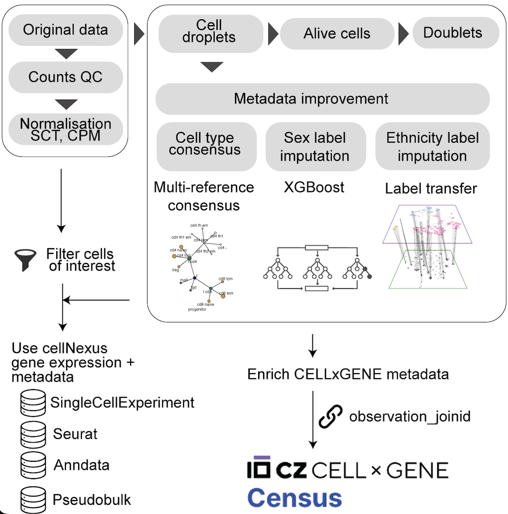

# cellNexus

`cellNexus` is a query interface for programmatic exploration and
retrieval of harmonised, curated, and reannotated CELLxGENE
human-cell-atlas data.



This standalone documentation website provides:

- Detailed data-processing information (quality control, harmonisation,
  and expression representations).
- Complete explanations of metadata columns used in filtering and
  interpretation.
- Guided examples for metadata-first exploration and gene-expression
  analysis.

## Data Processing Overview

The harmonisation pipeline standardises data across datasets so queries
are consistent across studies:

1.  Metadata are retrieved from cloud-hosted harmonised tables.
2.  Standardised quality control removes empty droplets, dead/damaged
    cells, and likely doublets.
3.  Cell-level data are served through common assay layers (`counts`,
    `cpm`, `sct`, `pseudobulk`).
4.  Outputs are returned in analysis-ready R formats such as
    `SingleCellExperiment` and `Seurat`.

### Quality control steps

The QC flags used throughout `cellNexus` are computed using
[HPCell](https://github.com/MangiolaLaboratory/HPCell). In brief:

- Empty droplets (`empty_droplet`):

- Computed from a `SingleCellExperiment`.

- Excludes mitochondrial genes and ribosomal genes before scoring:

- Computes, per cell, the number of expressed genes and flags a cell as
  an empty droplet when (n\_ \<) `RNA_feature_threshold` (by default
  200, except for targeted panels such as Rhapsody technology).

- Alive cells (`alive`):

  - Filters out empty droplets.
  - Computes per-cell QC metrics from raw counts using
    `scuttle::perCellQCMetrics(..., subsets=list(Mito=...))`, where the
    mitochondrial subset is defined by `^MT` in the feature names.
  - Determines **high mitochondrial content** via
    `scater::isOutlier(subsets_Mito_percent, type="higher")`. Outlier
    calling is performed **within each cell-type group** using our
    harmonised label `cell_type_unified_ensemble`.
  - Alive cells are labelled as those without high mitochondrial content
    (`!high_mitochondrion`).

- Doublets (`scDblFinder.class`):

  - Filters out empty droplets.
  - `scDblFinder::scDblFinder()` default parameters are used. For cells
    that cannot be classified by `scDblFinder`, the class is set to
    `"Unknown"` to avoid dropping cells.

### RNA abundance

- RNA counts:
  - RNA count distributions per sample are annotated from
    [cellxgenedp](https://github.com/mtmorgan/cellxgenedp), using the
    `x_approximate_distribution` column.
- CPM:
  - Counts-per-million normalisation computed from the raw counts assay
    via `scuttle::calculateCPM()`.
- Rank:
  - Per-cell gene-expression ranks computed with
    `singscore::rankGenes()`.
  - Implemented in column chunks (default 1000 cells per slice) to
    handle very large datasets; slices are written to disk as an
    `HDF5Array`-backed sparse integer matrix and then column-bound.
- SCT:
  - Variance-stabilising normalisation computed with Seurat
    `SCTransform()` (v2), with regression of cell-level covariates
    (`subsets_Mito_percent` and `subsets_Ribo_percent`).
  - QC filtering is applied first.
  - The median common scale across the whole resource is applied
    (scale_factor=2186)
- Pseudobulk:
  - All low-quality cells flagged by QC are removed before aggregation.
  - Aggregates counts across cells using
    `scuttle::aggregateAcrossCells()`, aggregating `sample_id` and the
    harmonised cell type (`cell_type_harmonised_ensemble`).

## Metadata Explore

Through harmonisation and curation, `cellNexus` adds columns that are
not present in the original CELLxGENE metadata alone.

| Column                              | Description                                                                      |
|-------------------------------------|----------------------------------------------------------------------------------|
| `cell_id`                           | Cell identifier.                                                                 |
| `observation_joinid`                | Cell ID join key linking metadata.                                               |
| `dataset_id`                        | Primary dataset identifier in the atlas.                                         |
| `sample_id`                         | Harmonised sample identifier.                                                    |
| `sample_`                           | Internal sample subdivision helper.                                              |
| `experiment___`                     | Upstream experiment grouping variable.                                           |
| `sample_heuristic`                  | Internal sample subdivision helper.                                              |
| `age_days`                          | Donor age in days.                                                               |
| `tissue_groups`                     | Coarse tissue grouping for analysis.                                             |
| `nFeature_expressed_in_sample`      | Number of expressed features per cell.                                           |
| `nCount_RNA`                        | Total RNA counts per cell (sample-aware).                                        |
| `empty_droplet`                     | Quality-control flag for empty droplets.                                         |
| `cell_type_unified_ensemble`        | Consensus immune identity from Azimuth and `SingleR` (Blueprint, Monaco).        |
| `is_immune`                         | Curated flag for immune-cell context.                                            |
| `subsets_Mito_percent`              | Percent of each cell’s total counts coming from mitochondrial genes in a sample. |
| `subsets_Ribo_percent`              | Percent of each cell’s total counts coming from ribosomal genes in a sample.     |
| `high_mitochondrion`                | TRUE if the cell’s mitochondrial percent exceeds the QC cutoff.                  |
| `high_ribosome`                     | TRUE if the cell’s ribosomal percent exceeds the QC cutoff.                      |
| `scDblFinder.class`                 | Quality-control flag for doublet classification from `scDblFinder`.              |
| `sample_chunk`                      | Internal sample subdivision chunks.                                              |
| `cell_chunk`                        | Internal cell subdivision chunks.                                                |
| `sample_pseudobulk_chunk`           | Internal pseudobulk subdivision chunks.                                          |
| `file_id_cellNexus_single_cell`     | Internal file id for single-cell layers.                                         |
| `file_id_cellNexus_pseudobulk`      | Internal file id for pseudobulk layers.                                          |
| `count_upper_bound`                 | Count capping threshold used in transformation.                                  |
| `nfeature_expressed_thresh`         | Threshold of the number of expressed features per cell.                          |
| `inverse_transform`                 | Transformation method used in pre-processing pipeline.                           |
| `alive`                             | Quality-control flag for viable cells (e.g. mitochondrial signal).               |
| `cell_annotation_blueprint_singler` | `SingleR` annotation (Blueprint).                                                |
| `cell_annotation_monaco_singler`    | `SingleR` annotation (Monaco).                                                   |
| `cell_annotation_azimuth_l2`        | Azimuth cell annotation.                                                         |
| `ethnicity_flagging_score`          | Supporting score for ethnicity imputation.                                       |
| `low_confidence_ethnicity`          | Supporting flag for low-confidence ethnicity calls.                              |
| `.aggregated_cells`                 | Post-QC cells combined into each pseudobulk sample.                              |
| `imputed_ethnicity`                 | Imputed ethnicity label.                                                         |
| `atlas_id`                          | cellNexus atlas release identifier (internal use).                               |

Field definitions for the CELLxGENE schema follow the [CELLxGENE schema
5.1.0](https://github.com/chanzuckerberg/single-cell-curation/blob/main/schema/5.1.0/schema.md),
and [CELLxGENE Census
schema](https://github.com/chanzuckerberg/cellxgene-census/blob/main/docs/cellxgene_census_schema.md#schema)

## Client Usage Examples

### R client (`cellNexus`)

``` r
library(cellNexus)
library(dplyr)
library(stringr)

metadata <- get_metadata() |>
  join_census_table()

metadata <- metadata |>
  keep_quality_cells()

query <- metadata |>
  filter(
    self_reported_ethnicity == "African",
    str_like(assay, "%10x%"),
    tissue == "lung parenchyma",
    str_like(cell_type, "%CD4%")
  )

sce <- get_single_cell_experiment(query, assays = c("counts", "cpm"))
pb <- get_pseudobulk(query)
```

### Python client (`cellNexusPy`)

Python support is available in the companion repository:
[`MangiolaLaboratory/cellNexusPy`](https://github.com/MangiolaLaboratory/cellNexusPy).

``` python
from cellnexuspy import get_metadata, get_anndata

sample_dataset = "https://object-store.rc.nectar.org.au/v1/AUTH_06d6e008e3e642da99d806ba3ea629c5/cellNexus-metadata/sample_metadata.1.3.0.parquet"
conn, table = get_metadata(parquet_url=sample_dataset)

table = table.filter("""
    empty_droplet = 'false'
    AND alive = 'true'
    AND "scDblFinder.class" != 'doublet'
    AND feature_count >= 5000
""")

query = table.filter("""
    self_reported_ethnicity = 'African'
    AND assay LIKE '%10%'
    AND tissue = 'lung parenchyma'
    AND cell_type LIKE '%CD4%'
""")

adata = get_anndata(query, assay="cpm")
pb = get_anndata(query, aggregation="pseudobulk")
conn.close()
```

For other implementation details and code examples, see [cellNexus
README](https://github.com/MangiolaLaboratory/cellNexus)
